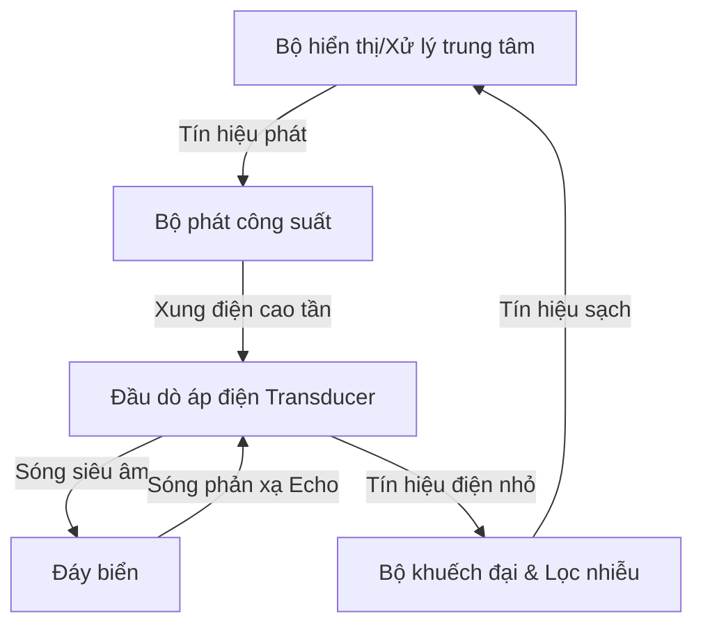

# BÁO CÁO NGHIÊN CỨU CHI TIẾT: THIẾT BỊ HÀNG HẢI CHUYÊN DỤNG VÀ CHUẨN DỮ LIỆU

Tài liệu này cung cấp thông tin kỹ thuật chuyên sâu về 7 thiết bị hàng hải quan trọng xuất hiện trong hình ảnh thực tế, bao gồm nguyên lý hoạt động, cấu tạo chi tiết, quy trình vận hành thực tế, các tiêu chuẩn pháp lý quốc tế (IMO, SOLAS, IEC, WMO, ISO) và cấu trúc dữ liệu đầu ra tiêu chuẩn (NMEA 0183/2000).

---

## 1. Ra-đa Hàng Hải Băng X (X-Band Marine Radar)

### 1.1. Nguyên lý hoạt động
Ra-đa băng X hoạt động dựa trên nguyên lý **RADAR** (*Radio Detection And Ranging*):
* **Băng tần hoạt động:** Hoạt động trong dải tần số **9.2 GHz đến 9.5 GHz** (bước sóng ngắn ~3.2 cm). Bước sóng ngắn giúp phân giải các mục tiêu nhỏ (phao tiêu, tàu nhỏ, đá ngầm) với độ chính xác cực cao.
* **Quy trình phát/thu:** Ăng-ten quay liên tục với tốc độ 24–48 vòng/phút, phát ra các xung sóng điện từ cực ngắn (từ 0.05 µs đến 1.2 µs). Khi sóng này va chạm mục tiêu, một phần năng lượng phản xạ ngược lại tạo thành tín hiệu dội (**Echo**).
* **Tính toán khoảng cách & Phương vị:**
  $$\text{Khoảng cách (Range)} = \frac{c \times \Delta t}{2}$$
  *(Trong đó $c \approx 3 \times 10^8 \text{ m/s}$ là vận tốc ánh sáng, $\Delta t$ là thời gian trễ từ khi phát đến khi thu nhận xung phản hồi).*
  
  **Phương vị (Bearing)** của mục tiêu được xác định trực tiếp thông qua hướng của góc quay ăng-ten tại thời điểm nhận tín hiệu dội so với hướng Bắc thật (True North) hoặc hướng mũi tàu (Heading).

### 1.2. Cấu tạo chi tiết
| Bộ phận | Chức năng chi tiết |
| :--- | :--- |
| **Ăng-ten quay (Scanner Unit)** | Thường sử dụng kiểu *Slotted Waveguide* (ăng-ten khe), dài 4–8 feet. Có búp sóng ngang rất hẹp ($0.75^\circ - 2.0^\circ$) để tăng độ phân giải phương vị, và búp sóng đứng rộng ($20^\circ - 25^\circ$) để đảm bảo thu phát ổn định khi tàu bị lắc dọc/lắc ngang. |
| **Khối thu phát (Transceiver)** | Chứa nguồn phát xung điện từ. Radar truyền thống dùng bóng chân không **Magnetron** công suất cao (4 kW, 10 kW, 25 kW). Radar hiện đại dùng công nghệ **Solid-State** (bán dẫn) kết hợp kỹ thuật nén xung (Pulse Compression) giúp tăng độ bền và độ phân giải khoảng cách. |
| **Bộ chuyển đổi phát/thu (Duplexer)** | Đóng vai trò như một van một chiều điện tử cực nhanh, bảo vệ bộ thu nhạy cảm không bị phá hủy bởi xung phát công suất lớn và chuyển hướng tín hiệu echo yếu vào bộ thu. |
| **Bộ xử lý tín hiệu & Hiển thị** | Loại bỏ nhiễu biển (*Sea Clutter*), nhiễu mưa (*Rain Clutter*), tích hợp bộ xử lý tự động bám bắt mục tiêu **ARPA** (*Automatic Radar Plotting Aid*) để vẽ quỹ đạo và tính toán nguy cơ va chạm. |

### 1.3. Vận hành thực tế trên tàu
1. **Khởi động:** Bật thiết bị sang chế độ **Standby** để làm nóng sợi nung Magnetron (thường mất 1–3 phút). Đối với radar Solid-state, bước này diễn ra tức thì.
2. **Phát sóng:** Chuyển sang chế độ **Transmit**.
3. **Hiệu chỉnh bộ lọc:**
   * Tăng **Gain** (độ khuếch đại) đến khi màn hình xuất hiện một chút nhiễu hạt nhẹ.
   * Điều chỉnh **A/C SEA** để lọc bỏ nhiễu phản xạ từ sóng biển sát mạn tàu.
   * Điều chỉnh **A/C RAIN** để lọc bỏ nhiễu phản xạ từ các hạt mưa/sương mù trong khu vực.
4. **Bám bắt mục tiêu:** Thiết lập vùng cảnh báo an toàn (**Guard Zone**). Sử dụng ARPA để chọn và bám bắt các tàu xung quanh nhằm tính toán khoảng cách tiếp cận gần nhất (**CPA**) và thời gian đạt CPA (**TCPA**).

### 1.4. Tiêu chuẩn quốc tế & Minh chứng pháp lý
* **SOLAS Chapter V, Regulation 19:** Bắt buộc tất cả các tàu từ 300 GT trở lên phải trang bị radar 9 GHz (X-band). Tàu từ 3000 GT trở lên phải trang bị thêm một radar 3 GHz (S-band) độc lập.
* **IMO Resolution MSC.192(79):** Quy định tiêu chuẩn hiệu năng kỹ thuật cho thiết bị radar hàng hải.
* **IEC 62388:** Quy định các phương pháp thử nghiệm và yêu cầu kỹ thuật đối với radar hàng hải thương mại.

---

## 2. La Bàn Vệ Tinh DGPS Có Chức Năng GNSS Denied

### 2.1. Nguyên lý hoạt động
Thiết bị này tích hợp công nghệ định vị vệ tinh chính xác cao cùng cảm biến quán tính tự trị:
* **Đo hướng bằng pha sóng mang (Carrier Phase Interferometry):** Thiết bị sử dụng tối thiểu 2 đến 3 ăng-ten GNSS cách nhau một khoảng cách cố định (baseline). Bằng cách đo độ lệch pha của sóng mang tín hiệu vệ tinh nhận được giữa các ăng-ten, hệ thống tính toán chính xác vector hướng giữa chúng, từ đó suy ra hướng mũi tàu thật (**True Heading**) độc lập với từ trường Trái Đất.
* **Hiệu chỉnh vi sai DGPS (Differential GPS):** Sử dụng các tín hiệu hiệu chuẩn mặt đất (trạm DGPS ven biển) hoặc vệ tinh SBAS giúp giảm thiểu các sai số do khí quyển, đồng hồ vệ tinh, nâng độ chính xác định vị xuống mức sub-mét (< 1m).
* **Cơ chế GNSS Denied (Chống mất tín hiệu vệ tinh):** Khi đi vào khu vực bị phá sóng vệ tinh (Jamming), giả mạo tọa độ (Spoofing) hoặc bị che khuất hoàn toàn bởi các kết cấu kim loại lớn (như dưới gầm cầu sắt, hẻm núi biển), thiết bị sẽ tự động chuyển đổi sang sử dụng cảm biến quán tính **IMU** (*Inertial Measurement Unit*) tích hợp bên trong. Thuật toán lọc **Kalman** nâng cao sẽ thực hiện phép toán **Dead Reckoning** (hàng hải quán tính) để duy trì việc xuất dữ liệu hướng đi (Heading), góc nghiêng dọc (Pitch) và nghiêng ngang (Roll) mà không bị gián đoạn.

### 2.2. Cấu tạo chi tiết
* **Khung ăng-ten đa cảm biến:** Chứa 2 hoặc 3 ăng-ten GNSS hiệu năng cao thu nhận đa tần số (L1/L2/L5) của nhiều chòm sao (GPS, GLONASS, Galileo, BeiDou).
* **Bộ cảm biến quán tính IMU:** Tích hợp các con quay hồi chuyển MEMS hoặc FOG (Fiber Optic Gyro) 3 trục và cảm biến gia tốc 3 trục để liên tục đo tốc độ góc và gia tốc tuyến tính của tàu.
* **Khối xử lý trung tâm:** Chạy thuật toán RTK/DGPS để tính pha sóng mang và thuật toán dung hợp cảm biến (Sensor Fusion) thời gian thực.

### 2.3. Vận hành thực tế trên tàu
* Lắp đặt tại vị trí cao nhất trên cabin tàu, tránh các vật cản che khuất tầm nhìn bầu trời và cách xa ăng-ten radar tối thiểu 1.5 mét để tránh nhiễu điện từ.
* Khi cấp nguồn, hệ thống tự động tìm kiếm vệ tinh và khóa pha sóng mang (thường mất 2–5 phút).
* Trong quá trình hành hải, hệ thống giám sát liên tục chỉ số nhiễu sóng vệ tinh (CNR). Nếu phát hiện tín hiệu bị phá hoặc mất đồng bộ hoàn toàn, hệ thống lập tức kích hoạt chế độ quán tính (IMU Backup Mode) để duy trì thông số lái cho hệ thống Autopilot và Radar mà không gây ra lỗi lệch hướng đột ngột nguy hiểm.

### 2.4. Tiêu chuẩn quốc tế & Minh chứng pháp lý
* **IMO Resolution MSC.116(73):** Tiêu chuẩn hiệu năng đối với thiết bị truyền hướng đi (THD - Transmitting Heading Devices).
* **ISO 22090-3:** Tiêu chuẩn quốc tế cho thiết bị THD sử dụng sóng vệ tinh GNSS.
* **IEC 61108-4:** Tiêu chuẩn kiểm tra và yêu cầu hiệu năng đối với thiết bị định vị vi sai DGPS.

---

## 3. Máy Đo Sâu (Echo Sounder)

### 3.1. Nguyên lý hoạt động
Máy đo sâu hàng hải sử dụng sóng âm để đo độ sâu từ đáy tàu đến đáy biển:
* **Quy trình truyền âm:** Đầu dò (Transducer) lắp dưới đáy tàu phát các xung siêu âm (tần số 20 kHz đến 200 kHz) hướng thẳng xuống đáy biển.
* **Phản xạ âm:** Sóng âm lan truyền trong nước biển với vận tốc khoảng 1500 m/s (tùy thuộc nhiệt độ, độ mặn, áp suất). Khi chạm đáy biển, sóng âm phản xạ ngược lại và được đầu dò thu nhận, chuyển đổi thành tín hiệu điện.
* **Tính toán độ sâu:**
  $$D = \frac{v \times t}{2}$$
  *(Trong đó $D$ là độ sâu dưới đầu dò, $v$ là vận tốc âm thanh trong nước, $t$ là tổng thời gian trễ từ khi phát đến khi thu).*

### 3.2. Cấu tạo chi tiết


* **Đầu dò (Transducer):** Làm bằng vật liệu gốm áp điện (Piezoelectric) có đặc tính co giãn khi có dòng điện xoay chiều chạy qua (phát sóng cơ học) và ngược lại sinh ra điện áp khi chịu lực nén cơ học (thu nhận sóng phản xạ).
* **Bộ thu phát & Xử lý:** Tạo ra xung điện áp cao để kích thích đầu dò phát sóng và khuếch đại tín hiệu dội yếu ớt từ đáy biển, lọc bỏ tạp âm sinh ra từ bọt khí chân vịt.
* **Màn hình hiển thị:** Hiển thị trực quan mặt cắt đáy biển (Echogram), chỉ số độ sâu dạng số lớn, cùng hệ thống còi cảnh báo nước nông.

### 3.3. Vận hành thực tế trên tàu
* Sĩ quan luôn bật máy đo sâu trước khi tàu rời cảng, đi vào luồng lạch hẹp hoặc khu vực có độ sâu hạn chế.
* **Cài đặt thông số mớn nước (Draft/Keel Offset):**
  * Thiết lập **Draft Offset** (bù mớn nước) để đo độ sâu thực tế từ mặt nước đến đáy biển.
  * Thiết lập **Keel Offset** (bù chiều sâu sống đáy) để đo khoảng cách an toàn từ điểm thấp nhất của vỏ tàu tới đáy biển.
* Điều chỉnh tần số phát: Tần số cao (200 kHz) dùng cho nước nông để có độ phân giải đáy sắc nét; tần số thấp (28 kHz / 50 kHz) dùng cho nước sâu vì sóng âm tần số thấp ít bị suy hao trong cột nước.

### 3.4. Tiêu chuẩn quốc tế & Minh chứng pháp lý
* **SOLAS Chapter V, Regulation 19:** Quy định tất cả các tàu từ 300 GT trở lên chạy tuyến quốc tế bắt buộc phải lắp đặt máy đo sâu.
* **IMO Resolution A.224(VII) & MSC.74(69) Annex 4:** Tiêu chuẩn hiệu năng cho thiết bị đo sâu hàng hải (yêu cầu ghi nhớ dữ liệu độ sâu tối thiểu 12 giờ).
* **ISO 9875:** Tiêu chuẩn kỹ thuật và phương pháp kiểm thử đối với máy đo sâu hàng hải.

---

## 4. Máy Đo Dữ Liệu Thời Tiết (Hệ Thống Đo Khí Tượng Tự Động - AWS)

### 4.1. Nguyên lý hoạt động
AWS trên tàu hoạt động liên tục nhờ sự dung hợp của nhiều cảm biến chuyển đổi các đại lượng vật lý khí tượng thành tín hiệu điện tử:
* **Đo áp suất khí quyển:** Sử dụng cảm biến áp suất dạng silicon vi cơ điện tử (MEMS). Áp suất khí quyển tác động lên màng silicon làm thay đổi điện trở hoặc điện dung của cảm biến.
* **Đo gió siêu âm (Ultrasonic Anemometer):** Thiết bị gồm các cặp đầu thu/phát siêu âm đối diện nhau. Sóng siêu âm truyền ngược chiều gió sẽ mất nhiều thời gian hơn so với xuôi chiều gió. Từ sự chênh lệch thời gian này, máy tính toán chính xác tốc độ và hướng gió mà không cần các cánh quạt cơ học chuyển động, loại bỏ hao mòn cơ khí do muối biển.
* **Đo nhiệt độ & Độ ẩm tương đối:** Sử dụng điện trở kim loại Pt100 (điện trở thay đổi tuyến tính theo nhiệt độ không khí) và cảm biến ẩm kiểu dung kháng polymer mỏng.

### 4.2. Cấu tạo chi tiết
* **Khối cảm biến tích hợp (Sensor Head):** Chứa cảm biến gió siêu âm, cảm biến nhiệt độ và độ ẩm được bọc trong một tấm chắn bức xạ mặt trời nhiều tầng (Radiation Shield) để tránh làm nóng cảm biến do ánh nắng trực tiếp.
* **Data Logger:** Bộ ghi và xử lý số liệu trung tâm, thực hiện việc số hóa tín hiệu cảm biến, tính toán giá trị gió thật (**True Wind**) dựa trên việc kết hợp dữ liệu gió tương đối (**Apparent Wind**) từ cảm biến và hướng đi/tốc độ của tàu từ la bàn và Speed Log.
* **Bộ hiển thị khí tượng:** Hiển thị biểu đồ xu hướng áp suất khí quyển (quan trọng để dự báo bão), độ ẩm, nhiệt độ không khí và thông tin gió.

### 4.3. Vận hành thực tế trên tàu
* Lắp đặt cảm biến khí tượng tại đỉnh cột buồm chính, nơi không bị che chắn bởi các kết cấu cabin để đảm bảo đo luồng gió tự nhiên không bị nhiễu quẩn.
* Sĩ quan theo dõi sự sụt giảm áp suất khí quyển đột ngột trên màn hình hiển thị (ví dụ sụt giảm > 3 hPa trong vòng 3 giờ là dấu hiệu thời tiết chuyển biến xấu hoặc có bão cận kề).
* Dữ liệu từ AWS được tự động tổng hợp thành các bản tin khí tượng tiêu chuẩn để báo cáo về các đài khí tượng quốc gia phục vụ dự báo thời tiết toàn cầu.

### 4.4. Tiêu chuẩn quốc tế & Minh chứng pháp lý
* **SOLAS Chapter V, Regulation 5:** Yêu cầu các quốc gia thành viên khuyến khích việc trang bị thiết bị khí tượng để nâng cao an toàn hàng hải.
* **WMO-No. 8 (Guide to Meteorological Instruments and Methods of Observation):** Tài liệu hướng dẫn chuẩn hóa của Tổ chức Khí tượng Thế giới về thiết bị đo đạc và quan trắc khí tượng.
* **IEC 60945:** Yêu cầu chung về môi trường và thử nghiệm đối với thiết bị hàng hải.

---

## 5. Máy Đo Tốc Độ (Speed Log)

### 5.1. Nguyên lý hoạt động
Có hai công nghệ chủ đạo được áp dụng để đo tốc độ tàu:

```
                  [ TÀU DI CHUYỂN ]
                         │
         ┌───────────────┴───────────────┐
         ▼                               ▼
┌──────────────────┐           ┌──────────────────┐
│ Doppler Speed Log│           │Electromagnetic Log│
├──────────────────┤           ├──────────────────┤
│ - Dịch tần số âm │           │ - Từ trường điện │
│ - Đo STW & SOG   │           │ - Chỉ đo STW     │
└──────────────────┘           └──────────────────┘
```

* **Doppler Speed Log (Máy đo tốc độ Doppler):**
  * Phát ra các chùm xung siêu âm góc nghiêng hướng xuống nước dưới đáy tàu.
  * Đo sự thay đổi tần số (dịch tần Doppler) của sóng phản xạ từ đáy biển hoặc từ các hạt lơ lửng trong nước:
    $$\Delta f = \frac{2 \times f_0 \times v \times \cos\theta}{c}$$
  * Ở vùng nước nông, sóng dội từ đáy biển cho ra tốc độ trên mặt đất (**Speed Over Ground - SOG**). Ở đại dương sâu, sóng dội từ lớp tán xạ nước cho ra tốc độ so với nước (**Speed Through Water - STW**).
* **Electromagnetic Speed Log (Máy đo tốc độ điện từ):**
  * Hoạt động theo định luật cảm ứng Faraday: Một cuộn dây bên trong cảm biến tạo ra một từ trường ổn định trong nước biển xung quanh.
  * Nước biển (chất dẫn điện) chảy qua từ trường khi tàu di chuyển sẽ sinh ra một điện áp cảm ứng siêu nhỏ giữa hai điện cực trên bề mặt cảm biến. Điện áp này tỷ lệ thuận với tốc độ dòng chảy của nước, cho ra tốc độ so với nước (**STW**).

### 5.2. Cấu tạo chi tiết
* **Đầu dò cảm biến (Sensor Probe):** Lắp đặt xuyên qua vỏ tàu tại khu vực 1/3 chiều dài tàu tính từ mũi (nơi dòng chảy ổn định nhất). Doppler log thường dùng cấu hình chùm tia **Janus** (phát chùm tia hướng trước và hướng sau) để triệt tiêu sai số do tàu lắc dọc.
* **Van ngăn nước (Gate Valve):** Cấu trúc cơ khí cho phép hạ cảm biến xuống nước hoặc thu hồi cảm biến lên để vệ sinh hà biển mà không cần phải đưa tàu lên đốc khô.
* **Bộ xử lý & Hiển thị:** Đọc điện áp cảm ứng hoặc đo tần số để chuyển thành đơn vị knots (hải lý/giờ).

### 5.3. Vận hành thực tế trên tàu
* Trước mỗi chuyến đi, kiểm tra bề mặt cảm biến. Nếu bị rêu hàng hoặc hà bám, dữ liệu đo tốc độ sẽ bị sai lệch nghiêm trọng.
* Khi di chuyển trên biển sâu, sĩ quan chuyển chế độ đo tốc độ sang hiển thị **STW** để phục vụ việc tính toán các góc va chạm trên radar (bởi động lực học va chạm phụ thuộc vào chuyển động tương đối giữa tàu với dòng nước). Khi cập cảng, sĩ quan chuyển sang hiển thị tốc độ đất **SOG** (bao gồm tốc độ dọc và tốc độ ngang mạn mũi/lái) để hỗ trợ điều khiển tàu áp sát cầu cảng.

### 5.4. Tiêu chuẩn quốc tế & Minh chứng pháp lý
* **SOLAS Chapter V, Regulation 19:** Bắt buộc trang bị thiết bị đo tốc độ qua nước (STW) cho tàu từ 300 GT trở lên. Tàu từ 50,000 GT trở lên phải trang bị thiết bị đo tốc độ trên mặt đất (SOG) độc lập.
* **IMO Resolution MSC.334(90):** Tiêu chuẩn hiệu năng sửa đổi cho thiết bị đo tốc độ và khoảng cách hàng hải (SDME).
* **IEC 61023:** Yêu cầu kỹ thuật và phương pháp thử nghiệm đối với thiết bị đo tốc độ hàng hải.

---

## 6. Hệ Thống Dẫn Đường Quán Tính (INS)

### 6.1. Nguyên lý hoạt động
Hệ thống INS hoạt động dựa trên nguyên lý cơ học Newton và tích phân quán tính:
* **Đo lường chuyển động cơ bản:** Bộ cảm biến quán tính IMU liên tục đo gia tốc tuyến tính ($a_x, a_y, a_z$) và vận tốc góc ($\omega_x, \omega_y, \omega_z$) của tàu dọc theo 3 trục không gian.
* **Tích phân dẫn đường:** Máy tính dẫn đường tích phân bậc nhất vận tốc góc để xác định tư thế của tàu (Roll, Pitch, Yaw/Heading). Nó xoay vector gia tốc đo được từ hệ tọa độ tàu sang hệ tọa độ Trái Đất, trừ đi gia tốc trọng trường, sau đó thực hiện tích phân bậc nhất để tính vận tốc tàu và tích phân bậc hai để tính tọa độ vị trí tức thời ($X, Y, Z$).
* **Dung hợp bộ lọc Kalman (Kalman Filter):** INS liên tục kết hợp dữ liệu hỗ trợ ngoài (từ GNSS, Speed Log, Echo Sounder) để ước lượng và hiệu chỉnh các sai số trôi (drift) cố hữu của con quay hồi chuyển và cảm biến gia tốc theo thời gian.

### 6.2. Cấu tạo chi tiết
```
┌───────────────────────────────────────────────┐
│              Thiết Bị Cảm Biến                │
│ ┌──────────────────────┐  ┌─────────────────┐ │
│ │ 3x Con quay hồi chuyển│  │ 3x Cảm biến     │ │
│ │ (Laser/Sợi quang FOG)│  │ gia tốc tuyến   │ │
│ └──────────┬───────────┘  └────────┬────────┘ │
└────────────┼───────────────────────┼──────────┘
             │ Vận tốc góc           │ Gia tốc
             ▼                       ▼
┌───────────────────────────────────────────────┐
│          Máy Tính Dẫn Đường Quán Tính         │
│          (Thuật toán nén bộ lọc Kalman)       │
└──────────────────────┬────────────────────────┘
                       ▼
┌───────────────────────────────────────────────┐
│            Dữ Liệu Đầu Ra Thời Gian Thực      │
│  - Hướng mũi tàu thật (True Heading)          │
│  - Vị trí tọa độ quán tính (INS Position)     │
│  - Góc tư thế động học (Roll, Pitch, Heave)  │
└───────────────────────────────────────────────┘
```

* **Cảm biến con quay cao cấp:** Thường sử dụng con quay sợi quang **FOG** (*Fiber Optic Gyro*) hoặc con quay laser **RLG** (*Ring Laser Gyro*). Không có bộ phận chuyển động cơ khí, cực kỳ bền bỉ và có độ trôi cực thấp ($< 0.01^\circ/\text{giờ}$).
* **Máy tính thuật toán:** Chạy các phương trình trạng thái chuyển động thời gian thực ở tần số rất cao (thường từ 100 Hz đến 1000 Hz).

### 6.3. Vận hành thực tế trên tàu
* **Giai đoạn Alignment (Căn chỉnh tìm Bắc):** Khi tàu đậu ở bến hoặc giữ hướng ổn định, INS cần thời gian tự căn chỉnh (thường từ 10–20 phút). Trong thời gian này, con quay hồi chuyển sẽ đo chuyển động tự quay của Trái Đất để xác định trục Bắc thật tự động (North-seeking) mà không cần vệ tinh.
* INS là nguồn cung cấp dữ liệu chuyển động gốc siêu ổn định, không trễ thời gian cho hệ thống ECDIS (Hải đồ điện tử), Radar quét bám bắt mục tiêu và Sonar siêu âm quét mảng pha dưới đáy tàu.

### 6.4. Tiêu chuẩn quốc tế & Minh chứng pháp lý
* **IMO Resolution MSC.252(83):** Tiêu chuẩn hiệu năng cho Hệ thống Dẫn đường Tích hợp (INS).
* **IEC 61924-2:** Hệ thống dẫn đường tích hợp (INS) - Tiêu chuẩn kiểm tra cấu trúc mô-đun và yêu cầu vận hành.

---

## 7. Máy Thu Phát Nhận Diện W-AIS (Automatic Identification System)

### 7.1. Phân loại thuật ngữ W-AIS
Trong kỹ thuật hàng hải, thuật ngữ **W-AIS** được định nghĩa tùy theo nhóm nhiệm vụ của phương tiện:
1. **Warship AIS (W-AIS):** Thiết bị AIS quân sự dành riêng cho các tàu hải quân, cảnh sát biển, lực lượng đặc nhiệm bảo vệ biên giới.
2. **Waterway AIS (Inland AIS):** Thiết bị AIS sông ngòi/đường thủy nội địa dùng cho sà lan, tàu đẩy, quản lý an toàn giao thông đường thủy nội thủy.

### 7.2. Nguyên lý hoạt động
* **Truy cập phân chia thời gian SOTDMA:** Hệ thống thu phát tự động trên tần số vô tuyến VHF hàng hải. Nhờ công nghệ SOTDMA, các tàu tự động đăng ký các khe thời gian phát sóng trong khung thời gian 1 phút mà không cần trạm điều phối mặt đất.
* **Đặc tính kỹ thuật của Warship AIS:**
  * **Chế độ bảo mật (Protected/Encrypted Mode):** Mã hóa toàn bộ dữ liệu vị trí và nhận dạng bằng các thuật toán mã hóa cấp quân sự (AES) để truyền trên các kênh VHF chiến thuật riêng biệt. Chỉ những tàu có khóa giải mã mới có thể thấy nhau trên hệ thống.
  * **Chế độ im lặng (Silent/Passive Mode):** Khóa chức năng phát sóng vô tuyến của máy phát, chỉ mở mạch thu để theo dõi các tàu dân sự xung quanh mà không để lộ vị trí của tàu chiến mình.
  * **Tạo mục tiêu ảo (Spoofing/Deception):** Khả năng cấu hình phát ra các vị trí giả lập hoặc thông tin tàu ảo để làm nhiễu loạn bức tranh tình báo của đối phương.
* **Đặc tính kỹ thuật của Inland AIS:**
  * Truyền các thông tin đặc thù cho sông ngòi như: Cấu hình đội sà lan (số lượng chiếc ghép nối dọc/ngang), chiều cao tĩnh không, cấp độ nguy hiểm hàng hóa (chỉ báo đèn hiệu hoặc hình nón xanh lam - blue cones).

### 7.3. Cấu tạo chi tiết
* **Bộ thu phát VHF:** Bao gồm 1 máy phát công suất lớn (thường chuyển đổi giữa 2W và 12.5W) và tối thiểu 2 máy thu độc lập hoạt động trên băng tần VHF hàng hải.
* **Module mã hóa (chỉ có trên Warship AIS):** Chip bảo mật cứng để thực hiện mã hóa/giải mã luồng dữ liệu thời gian thực.
* **Màn hình hiển thị & Điều khiển (MKD):** Bàn phím điều khiển và màn hình trực quan cho phép nhập mã định danh chiến thuật, cấu hình chế độ ẩn danh.

### 7.4. Vận hành thực tế trên tàu
* Đối với tàu quân sự, sĩ quan chỉ huy vận hành W-AIS linh hoạt: Bật chế độ công khai (Civilian Class A Mode) khi đi qua các luồng hàng hải quốc tế đông đúc để đảm bảo an toàn va chạm theo luật COLREGs; và chuyển sang chế độ mã hóa chiến thuật hoặc tắt phát sóng (Silent Mode) khi bắt đầu tham gia diễn tập chiến đấu hoặc tuần tra bảo vệ chủ quyền.

### 7.5. Tiêu chuẩn quốc tế & Minh chứng pháp lý
* **SOLAS Chapter V, Regulation 19:** Bắt buộc trang bị AIS Class A đối với tàu thương mại $\ge 300\text{ GT}$ chạy tuyến quốc tế.
* **STANAG 4668 & STANAG 4669 (NATO):** Tiêu chuẩn kỹ thuật về triển khai thiết bị Warship AIS (W-AIS) trên tàu hải quân của các nước thành viên liên minh NATO.
* **ITU-R M.1371:** Khuyến nghị quốc tế quy định chi tiết cấu trúc truyền thông vô tuyến lớp vật lý và lớp liên kết dữ liệu cho hệ thống AIS.
* **UNECE Standard for Tracking and Tracing on Inland Waterways (VTT):** Tiêu chuẩn Liên Hợp Quốc cho hệ thống Inland AIS sông ngòi.

---

## 8. Chuẩn Dữ Liệu Đầu Ra Chung (Data Output Standards)

Tất cả các thiết bị hàng hải nêu trên đều giao tiếp với nhau và truyền dữ liệu về thiết bị ghi dữ liệu hành trình tàu (VDR - Hộp đen tàu) hoặc hệ thống màn hình tích hợp (ECDIS) thông qua các tiêu chuẩn giao thức của Hiệp hội Điện tử Hàng hải Quốc gia (NMEA) và Ủy ban Kỹ thuật Điện Quốc tế (IEC).

### 8.1. Các chuẩn giao tiếp chính
* **NMEA 0183 (IEC 61162-1/2):** Giao tiếp nối tiếp sử dụng chuẩn vật lý RS-422. Truyền dữ liệu dưới dạng chuỗi ký tự ASCII ở tốc độ baud tiêu chuẩn là 4,800 bps (hoặc 38,400 bps đối với dữ liệu tốc độ cao như AIS).
* **NMEA 2000 (IEC 61162-3):** Giao tiếp mạng dựa trên giao thức CAN Bus công nghiệp. Tốc độ truyền 250 kbps dưới dạng nhị phân theo mã số nhóm tham số (PGN).
* **IEC 61162-450:** Chuẩn truyền dữ liệu hàng hải qua mạng Ethernet tốc độ cao. Dùng để truyền lượng dữ liệu lớn như video radar thô và tích hợp hệ thống dẫn đường cấp cao.

### 8.2. Cấu trúc câu lệnh NMEA 0183 tiêu chuẩn
Mỗi câu lệnh NMEA 0183 bắt đầu bằng ký tự `$` (hoặc `!` đối với dữ liệu đóng gói AIS) và kết thúc bằng ký tự kiểm tra lỗi Checksum đi sau dấu `*`:
```
$TTSSS,d1,d2,d3,...,dn*CC<CR><LF>
```
* **`$` / `!`:** Ký tự bắt đầu.
* **`TT` (Talker ID):** Mã nhận diện thiết bị phát tín hiệu.
  * `RA`: Radar hàng hải.
  * `GP` / `GN`: Thiết bị GPS/GNSS.
  * `HE` / `IN`: La bàn vệ tinh / Hệ thống dẫn đường quán tính (INS).
  * `SD`: Máy đo sâu (Sounder).
  * `WI`: Máy đo khí tượng (Weather Instrument).
  * `VD`: Máy đo tốc độ (Velocity Device).
  * `AI` / `AN`: Thiết bị thu phát AIS.
* **`SSS` (Sentence Formatter):** Mã định dạng kiểu dữ liệu của câu lệnh (ví dụ: GGA, HDT, DBT, MWV).
* **`d1, d2,..., dn`:** Các trường dữ liệu phân cách nhau bằng dấu phẩy.
* **`*CC`:** Checksum dạng Hexadecimal để kiểm tra tính toàn vẹn của chuỗi (tính toán bằng phép XOR của tất cả ký tự nằm giữa `$` và `*`).
* **`<CR><LF>`:** Cặp ký tự kết thúc dòng.

### 8.3. Bảng tổng hợp tham số chi tiết của tệp đầu ra theo thiết bị
Dưới đây là chi tiết các câu lệnh NMEA 0183 tiêu chuẩn mà các thiết bị xuất ra:

| Tên thiết bị | Câu lệnh NMEA | Cấu trúc câu lệnh mẫu | Các tham số chi tiết có trong tệp đầu ra |
| :--- | :--- | :--- | :--- |
| **Ra-đa băng X** | **`RATTM`** | `$--TTM,01,12.4,142.1,T,5.2,85.4,T,1.8,12.5,N,T,,*CC` | **01:** Số hiệu mục tiêu bám bắt (01–99).<br>**12.4:** Khoảng cách đến mục tiêu (hải lý).<br>**142.1:** Phương vị mục tiêu so với mũi tàu (độ).<br>**T:** Hướng phương vị thật (True).<br>**5.2:** Tốc độ mục tiêu (knots).<br>**85.4:** Hướng di chuyển thật của mục tiêu (độ).<br>**1.8:** Khoảng cách tiếp cận gần nhất CPA (hải lý).<br>**12.5:** Thời gian đạt CPA TCPA (phút).<br>**N:** Trạng thái mục tiêu (Query/Dangerous/Lost). |
| **La bàn vệ tinh** | **`HEHDT`**<br>**`GPGGA`** | `$HEHDT,145.8,T*1D`<br>`$GPGGA,123519,4807.038,N,01131.000,E,2,08,0.9,545.4,M,46.9,M,1.8,0000*47` | **145.8:** Hướng đi thật của tàu (°).<br>**123519:** Giờ UTC (12:35:19).<br>**4807.038,N:** Vĩ độ $48^\circ07.038'\text{ N}$.<br>**01131.000,E:** Kinh độ $11^\circ31.000'\text{ E}$.<br>**2:** Chỉ số định vị vi sai DGPS (chỉ số 2 chỉ mức chất lượng vi sai cao).<br>**08:** Số lượng vệ tinh thu nhận.<br>**545.4,M:** Độ cao anten so với mực nước biển (mét). |
| **Máy đo sâu** | **`SDDPT`**<br>**`SDDBT`** | `$SDDPT,014.2,000.8,050.0*58`<br>`$SDDBT,046.5,f,014.2,M,007.7,F*34` | **014.2:** Độ sâu tính từ bề mặt đầu dò (mét).<br>**000.8:** Khoảng cách bù mớn nước (Offset - dương là mớn nước để đo từ mặt nước, âm là đo từ sống đáy tàu).<br>**f / M / F:** Đơn vị đo độ sâu (Feet, Mét, Fathoms). |
| **Khí tượng** | **`WIMWV`**<br>**`WIXDR`** | `$WIMWV,240.0,R,12.5,N,A*1A`<br>`$WIXDR,P,1.013,B,BARO,C,24.5,C,TEMP,H,65.2,P,HUMI*22` | **240.0:** Hướng gió tương đối so với hướng mũi tàu (°).<br>**R:** Hướng gió tương đối (Relative).<br>**12.5,N:** Tốc độ gió (12.5 knots).<br>**A:** Trạng thái dữ liệu hợp lệ (Valid).<br>**1.013,B:** Áp suất khí quyển (1.013 bar).<br>**24.5,C:** Nhiệt độ không khí ($24.5^\circ\text{C}$).<br>**65.2,P:** Độ ẩm không khí tương đối (65.2%). |
| **Speed Log** | **`VDVBW`**<br>**`VDVLW`** | `$VDVBW,12.4,0.2,A,12.1,-0.1,A*4A`<br>`$VDVLW,01234.5,N,01210.2,N*5C` | **12.4 / 0.2:** Tốc độ dọc (12.4 knots) và tốc độ ngang (0.2 knot) qua nước (STW).<br>**12.1 / -0.1:** Tốc độ dọc (12.1 knots) và tốc độ ngang (-0.1 knot) trên mặt đất (SOG).<br>**A:** Trạng thái dữ liệu hợp lệ (A = Valid, V = Invalid).<br>**01234.5,N:** Tổng quãng đường đi qua nước (1234.5 hải lý).<br>**01210.2,N:** Tổng quãng đường đi trên đất (1210.2 hải lý). |
| **Hệ thống INS** | **`PASHR`** | `$PASHR,ATT,123456.78,145.82,T,-1.25,2.41,0.08,0.015,0.012,0*3B` | **123456.78:** Giờ hệ thống UTC.<br>**145.82,T:** Hướng đi True Heading tính toán từ INS (°).<br>**-1.25:** Góc Roll nghiêng ngang (°).<br>**2.41:** Góc Pitch nghiêng dọc (°).<br>**0.08:** Độ nhấp nhô đứng Heave (mét).<br>**0.015 / 0.012:** Độ sai số ước lượng vị trí vĩ độ và kinh độ (mét). |
| **W-AIS** | **`AIVDM`**<br>**`AIVDO`** | `!AIVDM,1,1,,A,13HOI20000OrC` `tPAd7uiOpDT0000,0*11` | Dòng dữ liệu đóng gói mã hóa nhị phân 6-bit. Sau khi giải mã bằng máy tính, nó cung cấp:<br>**MMSI:** Mã số nhận diện của trạm phát vô tuyến.<br>**Vị trí:** Vĩ độ, kinh độ chính xác.<br>**COG / SOG:** Hướng di chuyển và tốc độ di chuyển thật của tàu.<br>**Thông số tĩnh:** Tên tàu, hô hiệu gọi tàu (Call Sign), số IMO, kích thước tàu, loại hàng hóa vận chuyển. |

---

## 9. Danh Mục Tài Liệu Tham Khảo Và Link Minh Chứng Chính Thống

Để tra cứu sâu hơn hoặc kiểm tra tính pháp lý của dữ liệu kỹ thuật, dưới đây là danh sách các liên kết chính thức tới các cơ quan ban hành tiêu chuẩn quốc tế:

> [!NOTE]
> Các liên kết dưới đây dẫn thẳng tới trang chủ và các trang chuyên mục tài liệu pháp lý chính thức của các tổ chức hàng hải thế giới.

* **Tổ Chức Hàng Hải Quốc Tế (IMO):**
  * Trang thông tin các công ước an toàn: [IMO SOLAS Convention](https://www.imo.org/en/About/Conventions/Pages/International-Convention-for-the-Safety-of-Life-at-Sea-(SOLAS),-1974.aspx)
  * Quy định về trang thiết bị hàng hải: [IMO Navigation Equipment Standards](https://www.imo.org/en/OurWork/Safety/Pages/Navigation.aspx)
* **Ủy Ban Kỹ Thuật Điện Quốc Tế (IEC):**
  * Tiêu chuẩn kỹ thuật Radar: [IEC 62388 Standard for Marine Radars](https://webstore.iec.ch/publication/6958)
  * Tiêu chuẩn thiết bị đo tốc độ: [IEC 61023 Standard for Speed Log](https://webstore.iec.ch/publication/4260)
  * Chuẩn mạng dữ liệu Ethernet hàng hải: [IEC 61162-450 Ethernet Data Exchange](https://webstore.iec.ch/publication/4718)
* **Tổ Chức Khí Tượng Thế Giới (WMO):**
  * Hướng dẫn chính thức về thiết bị quan trắc khí tượng: [WMO-No. 8 Guide to Instruments](https://community.wmo.int/en/activity-areas/imop/wmo-no_8)
* **Tổ Chức Thủy Văn Quốc Tế (IHO):**
  * Tiêu chuẩn khảo sát đo sâu thủy văn: [IHO S-44 Standards](https://iho.int/en/standards-and-specifications)
* **Liên Minh Viễn Thông Quốc Tế (ITU):**
  * Khuyến nghị kỹ thuật cho thiết bị thu phát AIS: [ITU-R M.1371 Technical Characteristics](https://www.itu.int/rec/R-REC-M.1371)
* **Tài liệu học thuật & nghiên cứu kỹ thuật chuyên sâu:**
  * Giải thích cơ chế định vị quán tính: [Inertial Labs Navigation Learning Hub](https://www.inertiallabs.com)
  * Hướng dẫn kỹ thuật cảm biến thời tiết: [Vaisala Marine Weather Systems](https://www.vaisala.com)
  * Nguyên lý hoạt động của la bàn vệ tinh: [Furuno Marine Satellite Compass Technology](https://www.furuno.com)

---
*Tài liệu được cập nhật ngày 14 tháng 06 năm 2026. Mọi nội dung tuân thủ nghiêm ngặt các sửa đổi mới nhất của SOLAS Chương V.*
