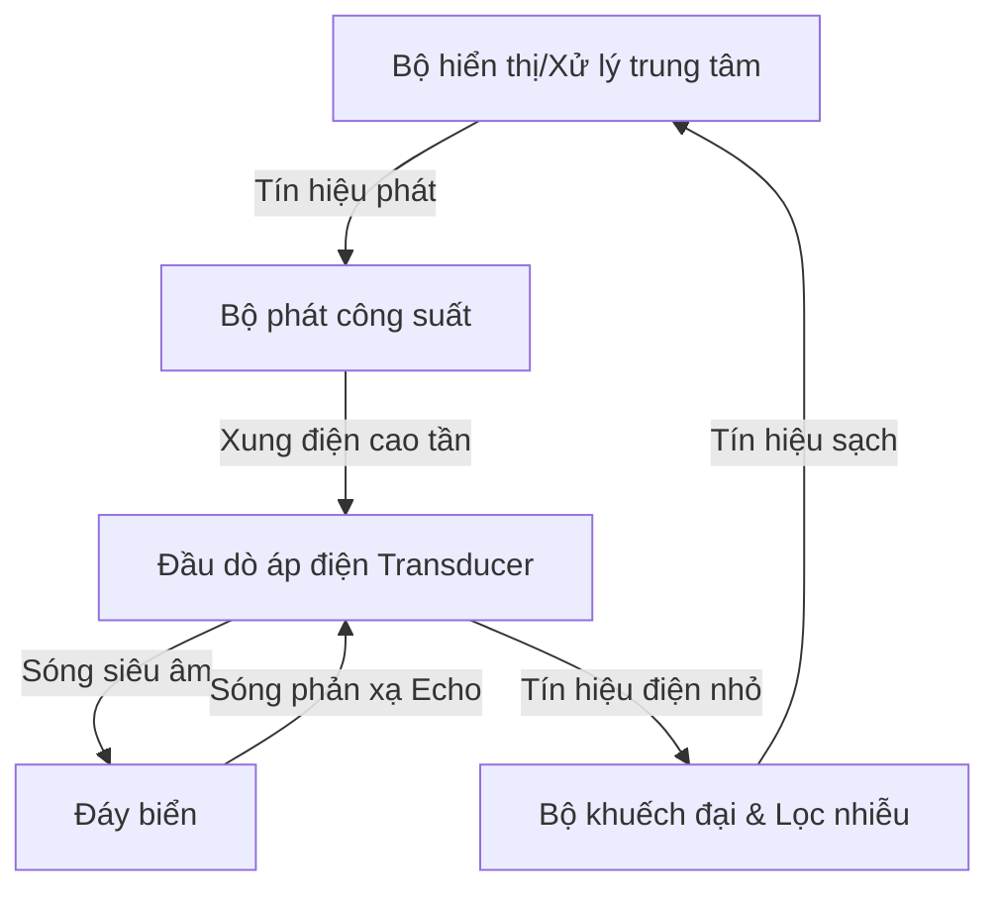

# BÁO CÁO NGHIÊN CỨU CHI TIẾT: THIẾT BỊ HÀNG HẢI CHUYÊN DỤNG VÀ CHUẨN DỮ LIỆU

Tài liệu này cung cấp thông tin kỹ thuật chuyên sâu về 7 thiết bị hàng hải quan trọng xuất hiện trong hình ảnh thực tế, bao gồm nguyên lý hoạt động, cấu tạo chi tiết, quy trình vận hành thực tế, các tiêu chuẩn pháp lý quốc tế (IMO, SOLAS, IEC, WMO, ISO) và cấu trúc dữ liệu đầu ra tiêu chuẩn (NMEA 0183/2000).

---

## 1. Ra-đa Hàng Hải Băng X (X-Band Marine Radar)

### 1.1. Nguyên lý hoạt động
Ra-đa băng X hoạt động dựa trên nguyên lý **RADAR** (*Radio Detection And Ranging*):
* **Băng tần hoạt động:** Hoạt động trong dải tần số **9.2 GHz đến 9.5 GHz** (bước sóng ngắn ~3.2 cm). Bước sóng ngắn giúp phân giải các mục tiêu nhỏ (phao tiêu, tàu nhỏ, đá ngầm) với độ chính xác cực cao.
* **Quy trình phát/thu:** Ăng-ten quay liên tục với tốc độ 24–48 vòng/phút, phát ra các xung sóng điện từ cực ngắn (từ 0.05 µs đến 1.2 µs). Khi sóng này va chạm mục tiêu, một phần năng lượng phản xạ ngược lại tạo thành tín hiệu dội (**Echo**).
* **Tính toán khoảng cách & Phương vị:**
  $$\text{Khoảng cách (Range)} = \frac{c \times \Delta t}{2}$$
  *(Trong đó $c \approx 3 \times 10^8 \text{ m/s}$ là vận tốc ánh sáng, $\Delta t$ là thời gian trễ từ khi phát đến khi thu nhận xung phản hồi).*
  
  **Phương vị (Bearing)** của mục tiêu được xác định trực tiếp thông qua hướng của góc quay ăng-ten tại thời điểm nhận tín hiệu dội so với hướng Bắc thật (True North) hoặc hướng mũi tàu (Heading).

### 1.2. Cấu tạo chi tiết
| Bộ phận | Chức năng chi tiết |
| :--- | :--- |
| **Ăng-ten quay (Scanner Unit)** | Thường sử dụng kiểu *Slotted Waveguide* (ăng-ten khe), dài 4–8 feet. Có búp sóng ngang rất hẹp ($0.75^\circ - 2.0^\circ$) để tăng độ phân giải phương vị, và búp sóng đứng rộng ($20^\circ - 25^\circ$) để đảm bảo thu phát ổn định khi tàu bị lắc dọc/lắc ngang. |
| **Khối thu phát (Transceiver)** | Chứa nguồn phát xung điện từ. Radar truyền thống dùng bóng chân không **Magnetron** công suất cao (4 kW, 10 kW, 25 kW). Radar hiện đại dùng công nghệ **Solid-State** (bán dẫn) kết hợp kỹ thuật nén xung (Pulse Compression) giúp tăng độ bền và độ phân giải khoảng cách. |
| **Bộ chuyển đổi phát/thu (Duplexer)** | Đóng vai trò như một van một chiều điện tử cực nhanh, bảo vệ bộ thu nhạy cảm không bị phá hủy bởi xung phát công suất lớn và chuyển hướng tín hiệu echo yếu vào bộ thu. |
| **Bộ xử lý tín hiệu & Hiển thị** | Loại bỏ nhiễu biển (*Sea Clutter*), nhiễu mưa (*Rain Clutter*), tích hợp bộ xử lý tự động bám bắt mục tiêu **ARPA** (*Automatic Radar Plotting Aid*) để vẽ quỹ đạo và tính toán nguy cơ va chạm. |

### 1.3. Vận hành thực tế trên tàu
1. **Khởi động:** Bật thiết bị sang chế độ **Standby** để làm nóng sợi nung Magnetron (thường mất 1–3 phút). Đối với radar Solid-state, bước này diễn ra tức thì.
2. **Phát sóng:** Chuyển sang chế độ **Transmit**.
3. **Hiệu chỉnh bộ lọc:**
   * Tăng **Gain** (độ khuếch đại) đến khi màn hình xuất hiện một chút nhiễu hạt nhẹ.
   * Điều chỉnh **A/C SEA** để lọc bỏ nhiễu phản xạ từ sóng biển sát mạn tàu.
   * Điều chỉnh **A/C RAIN** để lọc bỏ nhiễu phản xạ từ các hạt mưa/sương mù trong khu vực.
4. **Bám bắt mục tiêu:** Thiết lập vùng cảnh báo an toàn (**Guard Zone**). Sử dụng ARPA để chọn và bám bắt các tàu xung quanh nhằm tính toán khoảng cách tiếp cận gần nhất (**CPA**) và thời gian đạt CPA (**TCPA**).

### 1.4. Thông số đầu ra của cảm biến
* **Dải tần số phát:** $9300 \text{ MHz} - 9500 \text{ MHz}$.
* **Công suất đỉnh cực đại:** 4 kW đến 25 kW (Magnetron) hoặc 40W đến 200W (Solid-State).
* **Độ chính xác đo khoảng cách:** Sai số cực đại $\le 1\%$ thang cự ly đo đang chọn hoặc $30 \text{ mét}$ (lấy giá trị lớn hơn).
* **Độ chính xác đo phương vị:** Sai số $\le 1^\circ$.
* **Độ rộng búp sóng ngang (3 dB):** $0.95^\circ$ đến $1.9^\circ$ tùy theo độ dài thanh ăng-ten ($4 \text{ ft} - 8 \text{ ft}$).
* **Tần suất quét:** $24 \text{ RPM}$ (chế độ thường) hoặc $48 \text{ RPM}$ (chế độ tốc độ cao, tàu cao tốc HSC).

### 1.5. Tiêu chuẩn đầu ra & Pháp lý quốc tế
* **SOLAS Chapter V, Regulation 19:** Quy định tất cả tàu từ 300 GT trở lên phải trang bị một radar băng X (9 GHz). Tàu từ 3000 GT trở lên bắt buộc trang bị thêm một radar băng S (3 GHz) độc lập để xuyên nhiễu mưa tốt hơn.
* **IMO Resolution MSC.192(79):** Tiêu chuẩn hiệu năng kỹ thuật cho thiết bị radar lắp đặt trên tàu từ ngày 1/7/2008.
* **IEC 62388:** Quy định các tiêu chuẩn kỹ thuật kiểm thử phần cứng, phần mềm xử lý tín hiệu và hiển thị mục tiêu ARPA/AIS trên radar.

### 1.6. Chi tiết chuỗi dữ liệu đầu ra (Ví dụ & Giải thích)
Radar hàng hải xuất dữ liệu bám bắt mục tiêu ARPA thông qua câu lệnh tiêu chuẩn **`$--TTM`** (Tracked Target Message) của NMEA 0183.

**Ví dụ chuỗi dữ liệu đầu ra:**
```
$RATTM,05,08.23,112.4,T,12.5,090.5,T,0.85,04.2,N,MV_MARINER,T,A*1A
```

**Bảng giải thích chi tiết từng trường dữ liệu:**
| Trường | Giá trị ví dụ | Ý nghĩa kỹ thuật |
| :--- | :--- | :--- |
| `$RATTM` | `$RATTM` | Talker ID (`RA` = Radar) và định dạng câu lệnh (`TTM` = Tracked Target Message) |
| `05` | `05` | Số hiệu mục tiêu bám bắt (Target ID), từ 00 đến 99 |
| `08.23` | `08.23` | Khoảng cách từ tàu ta tới mục tiêu (Target Range), đơn vị Hải lý (NM) |
| `112.4` | `112.4` | Phương vị mục tiêu (Target Bearing), đơn vị độ ($^\circ$) |
| `T` | `T` | Hướng phương vị: `T` = True (Thật so với Bắc thật), `R` = Relative (Tương đối so với mũi tàu) |
| `12.5` | `12.5` | Tốc độ của mục tiêu (Target Speed), đơn vị knots (hải lý/giờ) |
| `090.5` | `090.5` | Hướng đi của mục tiêu (Target Course), đơn vị độ ($^\circ$) |
| `T` | `T` | Hướng đi mục tiêu: `T` = True (Thật), `R` = Relative (Tương đối) |
| `0.85` | `0.85` | Khoảng cách tiếp cận gần nhất CPA (Closest Point of Approach), đơn vị Hải lý (NM) |
| `04.2` | `04.2` | Thời gian đến điểm CPA TCPA (Time to CPA), đơn vị phút. Giá trị dương là đang tiến gần, âm là đã đi qua |
| `N` | `N` | Đơn vị đo khoảng cách: `N` = Nautical Miles (Hải lý) |
| `MV_MARINER` | `MV_MARINER` | Tên của mục tiêu (chữ hoặc số nhận diện) |
| `T` | `T` | Trạng thái bám bắt mục tiêu: `T` = Tracking (Đang theo dõi), `L` = Lost (Mất mục tiêu), `Q` = Query |
| `A` | `A` | Phương thức bám bắt: `A` = Automatic (Tự động quét bắt), `M` = Manual (Chọn bằng tay) |
| `*1A` | `*1A` | Checksum Hexadecimal để kiểm lỗi tính toàn vẹn của chuỗi |

> [!NOTE]
> **Sự sai khác thực tế về tham số Target Status (Trạng thái bám bắt) trong chuỗi RATTM**
> 
> * **Theo chuẩn quốc tế lý thuyết (NMEA 0183 / IEC 61162-1):** Trường dữ liệu Target Status được quy định chặt chẽ là sử dụng chữ in hoa:
>   * `T` = Tracking (Mục tiêu đang được bám bắt và tính toán quỹ đạo ổn định).
>   * `L` = Lost (Mục tiêu đã bị mất dấu do đi ra ngoài tầm quét radar hoặc bị che khuất).
>   * `Q` = Query (Radar đang trong quá trình truy vấn, đang dò tìm để khóa mục tiêu, chưa chốt số liệu).
> 
> * **Theo dữ liệu log thực tế:** Khi trích xuất dữ liệu từ một số dòng máy cụ thể (có thể do phiên bản phần mềm hoặc quy định riêng của hãng), thiết bị lại trả về dạng chữ thường:
>   * `b` = Đang bám bắt ổn định (Tracked - Ký hiệu chữ 'b' có thể là viết tắt của từ "bám bắt" hoặc một mã quy ước riêng của thiết bị).
>   * `q` = Đang truy vấn.
>   * `l` = Mất dấu mục tiêu.
> 
> **=> Đúc kết dành cho kỹ sư/lập trình viên:** Đây là hiện tượng "biến thể thực tế" (proprietary variation) rất thường gặp khi làm việc với nhiều hệ thống hàng hải từ các hãng khác nhau. Khi lập trình viết phần mềm giải mã (Parser) để tích hợp lên tàu, để hệ thống chạy ổn định và tương thích ngược, lập trình viên bắt buộc phải cấu hình đọc chấp nhận cả 2 trường hợp. (Ví dụ đoạn code: `if (status == 'T' || status == 'b') { Xác nhận Tracking mục tiêu }`). Dừng lại ở chuẩn lý thuyết là chưa đủ để xử lý thực tiễn trên tàu.

> [!TIP]
> **Giải thích chi tiết về "Checksum Hexadecimal"**
> 
> Trong chuẩn truyền dữ liệu NMEA 0183 của các thiết bị hàng hải, Checksum là cơ chế cốt lõi để kiểm tra tính toàn vẹn của dữ liệu (Data Integrity Check).
> 
> * **Vị trí và Cấu trúc:** Nó luôn nằm ở tận cùng của chuỗi dữ liệu, được ngăn cách bởi một dấu sao `*` và theo sau là 2 ký tự Hexadecimal (Hệ cơ số 16, biểu diễn giá trị từ `00` đến `FF`).
>   * *Ví dụ:* Trong chuỗi `$RATTM,...*3F`, thì `3F` chính là mã Checksum Hexadecimal.
> * **Cách máy tính tạo ra Checksum:**
>   * Cảm biến (máy phát) sẽ lấy tất cả các ký tự nằm giữa dấu `$` (hoặc `!`) và dấu `*`.
>   * Thiết bị sẽ thực hiện phép toán logic **XOR (Exclusive OR)** trên mã ASCII của lần lượt từng ký tự này. Kết quả của chuỗi phép toán này sẽ ra một con số nhị phân 8-bit, sau đó được đổi sang hệ Hexadecimal và gắn vào cuối câu.
> * **Tại sao lại cần nó?** Trên tàu biển, cáp tín hiệu thường chạy rất dài và môi trường thì chịu nhiễu điện từ cực mạnh (từ radar phát sóng công suất lớn, máy phát điện, motor). Nhiễu có thể làm dữ liệu đang truyền bị biến dạng (VD: Số 5 bị méo thành số 9).
>   * Khi máy tính (hoặc màn hình) nhận được chuỗi dữ liệu, phần mềm giải mã sẽ lấy các ký tự vừa nhận được để làm lại phép tính XOR.
>   * Sau đó, nó đem kết quả tính được so sánh với 2 ký tự Hexa ở cuối chuỗi.
>   * **Nếu khớp nhau:** Dữ liệu đúng 100%, có thể đem đi tính toán chống đâm va.
>   * **Nếu sai lệch:** Đường truyền đã bị nhiễu làm biến đổi dữ liệu, hệ thống bắt buộc phải vứt bỏ (Drop) ngay lập tức chuỗi này chờ chuỗi sau, tuyệt đối không được tin tưởng.

---

## 2. La Bàn Vệ Tinh DGPS Có Chức Năng GNSS Denied

### 2.1. Nguyên lý hoạt động
* **Đo hướng bằng pha sóng mang (Carrier Phase Interferometry):** Thiết bị sử dụng tối thiểu 2 đến 3 ăng-ten GNSS cách nhau một khoảng cách cố định (baseline). Bằng cách đo độ lệch pha của sóng mang tín hiệu vệ tinh nhận được giữa các ăng-ten, hệ thống tính toán chính xác vector hướng giữa chúng, từ đó suy ra hướng mũi tàu thật (**True Heading**) độc lập với từ trường Trái Đất.
* **Hiệu chỉnh vi sai DGPS (Differential GPS):** Sử dụng các tín hiệu hiệu chuẩn mặt đất (trạm DGPS ven biển) hoặc vệ tinh SBAS giúp giảm thiểu các sai số do khí quyển, đồng hồ vệ tinh, nâng độ chính xác định vị xuống mức sub-mét (< 1m).
* **Cơ chế GNSS Denied (Chống mất tín hiệu vệ tinh):** Khi đi vào khu vực bị phá sóng vệ tinh (Jamming), giả mạo tọa độ (Spoofing) hoặc bị che khuất hoàn toàn bởi các kết cấu kim loại lớn (như dưới gầm cầu sắt, hẻm núi biển), thiết bị sẽ tự động chuyển đổi sang sử dụng cảm biến quán tính **IMU** (*Inertial Measurement Unit*) tích hợp bên trong. Thuật toán lọc **Kalman** nâng cao sẽ thực hiện phép toán **Dead Reckoning** (hàng hải quán tính) để duy trì việc xuất dữ liệu hướng đi (Heading), góc nghiêng dọc (Pitch) và nghiêng ngang (Roll) mà không bị gián đoạn.

### 2.2. Cấu tạo chi tiết
* **Khung ăng-ten đa cảm biến:** Chứa 2 hoặc 3 ăng-ten GNSS hiệu năng cao thu nhận đa tần số (L1/L2/L5) của nhiều chòm sao (GPS, GLONASS, Galileo, BeiDou).
* **Bộ cảm biến quán tính IMU:** Tích hợp các con quay hồi chuyển MEMS hoặc FOG (Fiber Optic Gyro) 3 trục và cảm biến gia tốc 3 trục để liên tục đo tốc độ góc và gia tốc tuyến tính của tàu.
* **Khối xử lý trung tâm:** Chạy thuật toán RTK/DGPS để tính pha sóng mang và thuật toán dung hợp cảm biến (Sensor Fusion) thời gian thực.

### 2.3. Vận hành thực tế trên tàu
* Lắp đặt tại vị trí cao nhất trên cabin tàu, tránh các vật cản che khuất tầm nhìn bầu trời và cách xa ăng-ten radar tối thiểu 1.5 mét để tránh nhiễu điện từ.
* Khi cấp nguồn, hệ thống tự động tìm kiếm vệ tinh và khóa pha sóng mang (thường mất 2–5 phút).
* Trong quá trình hành hải, hệ thống giám sát liên tục chỉ số nhiễu sóng vệ tinh (CNR). Nếu phát hiện tín hiệu bị phá hoặc mất đồng bộ hoàn toàn, hệ thống lập tức kích hoạt chế độ quán tính (IMU Backup Mode) để duy trì thông số lái cho hệ thống Autopilot và Radar mà không gây ra lỗi lệch hướng đột ngột nguy hiểm.

### 2.4. Thông số đầu ra của cảm biến
* **Độ chính xác hướng đi (Heading Accuracy):** $\pm 0.2^\circ$ (với baseline ăng-ten $1.0\text{ m}$) hoặc $\pm 0.5^\circ$ (với baseline $0.5\text{ m}$).
* **Độ chính xác Pitch/Roll:** $\pm 0.5^\circ$ đến $\pm 1.0^\circ$ (đo động động học).
* **Độ chính xác vị trí DGPS:** $< 0.5 \text{ mét}$ (Circular Error Probable - CEP, 95% thời gian).
* **Thời gian thiết lập hướng đi ban đầu (Alignment Time):** $< 4 \text{ phút}$ (trạng thái khởi động lạnh).
* **Tần suất cập nhật dữ liệu (Update Rate):** Từ $10 \text{ Hz}$ đến $50 \text{ Hz}$ (thời gian thực, không trễ).
* **Thời gian duy trì hướng đi quán tính (GNSS Denied Drift Rate):** Sai số trôi la bàn $< 1^\circ/\text{giờ}$ khi mất định vị vệ tinh.

### 2.5. Tiêu chuẩn đầu ra & Pháp lý quốc tế
* **IMO Resolution MSC.116(73):** Tiêu chuẩn hiệu năng đối với thiết bị truyền thông tin hướng đi (THD - Transmitting Heading Devices).
* **ISO 22090-3:** Tiêu chuẩn quốc tế cho thiết bị THD sử dụng sóng vệ tinh GNSS.
* **IEC 61108-4:** Tiêu chuẩn kiểm thử phần cứng và yêu cầu hiệu năng đối với thiết bị định vị vi sai DGPS/DGLONASS.

### 2.6. Chi tiết chuỗi dữ liệu đầu ra (Ví dụ & Giải thích)
La bàn vệ tinh truyền dữ liệu định vị vi sai DGPS bằng câu lệnh **`$GPGGA`** và hướng mũi tàu thật bằng câu lệnh **`$HEHDT`**.

#### Ví dụ chuỗi dữ liệu định vị DGPS `$GPGGA`:
```
$GPGGA,081530.00,2045.1234,N,10645.4567,E,2,12,0.8,12.5,M,-2.4,M,2.0,0123*4F
```

**Bảng giải thích chi tiết từng trường dữ liệu `$GPGGA`:**
| Trường | Giá trị ví dụ | Ý nghĩa kỹ thuật |
| :--- | :--- | :--- |
| `$GPGGA` | `$GPGGA` | Talker ID (`GP` = GPS) và định dạng câu lệnh (`GGA` = GPS Fix Data) |
| `081530.00` | `081530.00` | Thời gian thu nhận dữ liệu theo giờ chuẩn quốc tế UTC (08:15:30.00) |
| `2045.1234,N` | `2045.1234,N` | Vĩ độ: $20^\circ 45.1234'$ Bắc (`N`) |
| `10645.4567,E` | `10645.4567,E` | Kinh độ: $106^\circ 45.4567'$ Đông (`E`) |
| `2` | `2` | Chất lượng định vị: `0` = Hỏng/Không bắt được, `1` = GPS thường, `2` = Định vị vi sai DGPS, `4` = RTK Fixed |
| `12` | `12` | Số lượng vệ tinh đang được khóa và sử dụng để định vị |
| `0.8` | `0.8` | Chỉ số giảm độ chính xác hình học mặt phẳng HDOP (Horizontal Dilution of Precision) |
| `12.5,M` | `12.5,M` | Độ cao của ăng-ten so với mặt nước biển trung bình (MSL), đơn vị Mét (`M`) |
| `-2.4,M` | `-2.4,M` | Độ cao Geoid so với bề mặt Ellipsoid WGS84, đơn vị Mét (`M`) |
| `2.0` | `2.0` | Tuổi của dữ liệu hiệu chỉnh DGPS (Age of DGPS data), đơn vị giây |
| `0123` | `0123` | Mã số nhận diện của trạm DGPS phát sóng hiệu chỉnh (Station ID) |
| `*4F` | `*4F` | Checksum Hexadecimal |

#### Ví dụ chuỗi dữ liệu hướng tàu thật `$HEHDT`:
```
$HEHDT,145.8,T*1D
```
* **`HE`**: Talker ID (Heading - Gyro/Satellite compass).
* **`HDT`**: Heading - True (Hướng đi thật).
* **`145.8`**: Góc hướng tàu thật là $145.8^\circ$ (so với hướng Bắc thật).
* **`T`**: Ký tự biểu thị True (Thật).
* **`*1D`**: Checksum.

---

## 3. Máy Đo Sâu (Echo Sounder)

### 3.1. Nguyên lý hoạt động
Máy đo sâu hàng hải sử dụng sóng âm để đo độ sâu từ đáy tàu đến đáy biển:
* **Quy trình truyền âm:** Đầu dò (Transducer) lắp dưới đáy tàu phát các xung siêu âm (tần số 20 kHz đến 200 kHz) hướng thẳng xuống đáy biển.
* **Phản xạ âm:** Sóng âm lan truyền trong nước biển với vận tốc khoảng 1500 m/s (tùy thuộc nhiệt độ, độ mặn, áp suất). Khi chạm đáy biển, sóng âm phản xạ ngược lại và được đầu dò thu nhận, chuyển đổi thành tín hiệu điện.
* **Tính toán độ sâu:**
  $$D = \frac{v \times t}{2}$$
  *(Trong đó $D$ là độ sâu dưới đầu dò, $v$ là vận tốc âm thanh trong nước, $t$ là tổng thời gian trễ từ khi phát đến khi thu).*

### 3.2. Cấu tạo chi tiết


* **Đầu dò (Transducer):** Làm bằng vật liệu gốm áp điện (Piezoelectric) có đặc tính co giãn khi có dòng điện xoay chiều chạy qua (phát sóng cơ học) và ngược lại sinh ra điện áp khi chịu lực nén cơ học (thu nhận sóng phản xạ).
* **Bộ thu phát & Xử lý:** Tạo ra xung điện áp cao để kích thích đầu dò phát sóng và khuếch đại tín hiệu dội yếu ớt từ đáy biển, lọc bỏ tạp âm sinh ra từ bọt khí chân vịt.
* **Màn hình hiển thị:** Hiển thị trực quan mặt cắt đáy biển (Echogram), chỉ số độ sâu dạng số lớn, cùng hệ thống còi cảnh báo nước nông.

### 3.3. Vận hành thực tế trên tàu
* Sĩ quan luôn bật máy đo sâu trước khi tàu rời cảng, đi vào luồng lạch hẹp hoặc khu vực có độ sâu hạn chế.
* **Cài đặt thông số mớn nước (Draft/Keel Offset):**
  * Thiết lập **Draft Offset** (bù mớn nước) để đo độ sâu thực tế từ mặt nước đến đáy biển.
  * Thiết lập **Keel Offset** (bù chiều sâu sống đáy) để đo khoảng cách an toàn từ điểm thấp nhất của vỏ tàu tới đáy biển.
* Điều chỉnh tần số phát: Tần số cao (200 kHz) dùng cho nước nông để có độ phân giải đáy sắc nét; tần số thấp (28 kHz / 50 kHz) dùng cho nước sâu vì sóng âm tần số thấp ít bị suy hao trong cột nước.

### 3.4. Thông số đầu ra của cảm biến
* **Dải thang đo độ sâu (Depth Range):** $0.5 \text{ m}$ đến $600 \text{ m}$ (ở tần số $200\text{ kHz}$) hoặc lên đến $2000 \text{ m}$ (ở tần số thấp $50\text{ kHz}$).
* **Độ chính xác đo đạc:** Sai số $\le \pm 1.0\%$ của thang đo độ sâu đang áp dụng.
* **Tần số siêu âm hoạt động:** $28\text{ kHz}, 50\text{ kHz}, 200\text{ kHz}$ (thường cấu hình Dual-frequency phát đồng thời).
* **Tốc độ lặp xung (Ping Rate):** Tự động điều chỉnh theo độ sâu, tối đa $20\text{ pings/giây}$ (nước nông) và tối thiểu $1\text{ ping/giây}$ (nước sâu).
* **Độ phân giải hiển thị:** $0.1 \text{ m}$ đối với dải nước nông ($<20 \text{ m}$) và $1 \text{ m}$ đối với dải sâu.

### 3.5. Tiêu chuẩn đầu ra & Pháp lý quốc tế
* **SOLAS Chapter V, Regulation 19:** Bắt buộc trang bị máy đo sâu đối với tất cả tàu từ 300 GT trở lên chạy tuyến quốc tế.
* **IMO Resolution A.224(VII) & MSC.74(69) Annex 4:** Thiết bị phải lưu trữ được lịch sử độ sâu tối thiểu 12 giờ trước đó kèm theo thời gian, tọa độ và hiển thị cự ly tương tự/số.
* **ISO 9875:** Tiêu chuẩn quy định các yêu cầu kỹ thuật chi tiết của thiết bị đo sâu và phương pháp thử nghiệm điện-âm học.

### 3.6. Chi tiết chuỗi dữ liệu đầu ra (Ví dụ & Giải thích)
Máy đo sâu phát dữ liệu độ sâu và mớn nước thông qua câu lệnh **`$SDDPT`** (Depth) và **`$SDDBT`** (Depth Below Transducer).

#### Ví dụ chuỗi dữ liệu độ sâu `$SDDPT`:
```
$SDDPT,0018.5,000.8,0100.0*57
```

**Bảng giải thích chi tiết từng trường dữ liệu `$SDDPT`:**
| Trường | Giá trị ví dụ | Ý nghĩa kỹ thuật |
| :--- | :--- | :--- |
| `$SDDPT` | `$SDDPT` | Talker ID (`SD` = Depth Sounder) và định dạng câu lệnh (`DPT` = Depth) |
| `0018.5` | `0018.5` | Chiều sâu đo được từ đầu dò cảm biến đến đáy biển (đơn vị Mét) |
| `000.8` | `000.8` | Giá trị bù lệch (Offset). Dương biểu thị mớn nước của tàu (Draft Offset), lúc này độ sâu từ mặt nước = 18.5 + 0.8 = 19.3m. Nếu âm biểu thị khoảng cách từ đầu dò đến đáy sống tàu (Keel Offset) để tính khoảng cách đáy tàu đến đáy biển |
| `0100.0` | `0100.0` | Thang đo độ sâu tối đa được cài đặt hiện tại trên máy (đơn vị Mét) |
| `*57` | `*57` | Checksum Hexadecimal |

#### Ví dụ chuỗi dữ liệu độ sâu dưới đầu dò `$SDDBT`:
```
$SDDBT,0060.7,f,0018.5,M,0010.1,F*0C
```
* **`0060.7,f`**: Độ sâu đo được là $60.7$ feet (`f`).
* **`0018.5,M`**: Tương đương $18.5$ mét (`M`).
* **`0010.1,F`**: Tương đương $10.1$ fathoms (`F`) (đơn vị đo sâu truyền thống Anh).

---

## 4. Máy Đo Dữ Liệu Thời Tiết (Hệ Thống Đo Khí Tượng Tự Động - AWS)

### 4.1. Nguyên lý hoạt động
AWS trên tàu hoạt động liên tục nhờ sự dung hợp của nhiều cảm biến chuyển đổi các đại lượng vật lý khí tượng thành tín hiệu điện tử:
* **Đo áp suất khí quyển:** Sử dụng cảm biến áp suất dạng silicon vi cơ điện tử (MEMS). Áp suất khí quyển tác động lên màng silicon làm thay đổi điện trở hoặc điện dung của cảm biến.
* **Đo gió siêu âm (Ultrasonic Anemometer):** Thiết bị gồm các cặp đầu thu/phát siêu âm đối diện nhau. Sóng siêu âm truyền ngược chiều gió sẽ mất nhiều thời gian hơn so với xuôi chiều gió. Từ sự chênh lệch thời gian này, máy tính toán chính xác tốc độ và hướng gió mà không cần các cánh quạt cơ học chuyển động, loại bỏ hao mòn cơ khí do muối biển.
* **Đo nhiệt độ & Độ ẩm tương đối:** Sử dụng điện trở kim loại Pt100 (điện trở thay đổi tuyến tính theo nhiệt độ không khí) và cảm biến ẩm kiểu dung kháng polymer mỏng.

### 4.2. Cấu tạo chi tiết
* **Khối cảm biến tích hợp (Sensor Head):** Chứa cảm biến gió siêu âm, cảm biến nhiệt độ và độ ẩm được bọc trong một tấm chắn bức xạ mặt trời nhiều tầng (Radiation Shield) để tránh làm nóng cảm biến do ánh nắng trực tiếp.
* **Data Logger:** Bộ ghi và xử lý số liệu trung tâm, thực hiện việc số hóa tín hiệu cảm biến, tính toán giá trị gió thật (**True Wind**) dựa trên việc kết hợp dữ liệu gió tương đối (**Apparent Wind**) từ cảm biến và hướng đi/tốc độ của tàu từ la bàn và Speed Log.
* **Bộ hiển thị khí tượng:** Hiển thị biểu đồ xu hướng áp suất khí quyển (quan trọng để dự báo bão), độ ẩm, nhiệt độ không khí và thông tin gió.

### 4.3. Vận hành thực tế trên tàu
* Lắp đặt cảm biến khí tượng tại đỉnh cột buồm chính, nơi không bị che chắn bởi các kết cấu cabin để đảm bảo đo luồng gió tự nhiên không bị nhiễu quẩn.
* Sĩ quan theo dõi sự sụt giảm áp suất khí quyển đột ngột trên màn hình hiển thị (ví dụ sụt giảm > 3 hPa trong vòng 3 giờ là dấu hiệu thời tiết chuyển biến xấu hoặc có bão cận kề).
* Dữ liệu từ AWS được tự động tổng hợp thành các bản tin khí tượng tiêu chuẩn để báo cáo về các đài khí tượng quốc gia phục vụ dự báo thời tiết toàn cầu.

### 4.4. Thông số đầu ra của cảm biến
* **Dải đo tốc độ gió:** $0$ đến $60 \text{ m/s}$ (độ chính xác $\pm 3\%$ hoặc $\pm 0.3 \text{ m/s}$).
* **Dải hướng gió:** $0^\circ$ đến $359^\circ$ (độ chính xác $\pm 2.0^\circ$).
* **Dải đo áp suất khí quyển:** $600 \text{ hPa}$ đến $1100 \text{ hPa}$ (độ chính xác $\pm 0.5 \text{ hPa}$).
* **Dải nhiệt độ môi trường:** $-40^\circ\text{C}$ đến $+60^\circ\text{C}$ (độ chính xác $\pm 0.2^\circ\text{C}$).
* **Dải đo độ ẩm không khí:** $0\%$ đến $100\%$ RH (độ chính xác $\pm 2.0\%$ RH).
* **Tần suất cập nhật:** $1 \text{ Hz}$ (1 lần mỗi giây).

### 4.5. Tiêu chuẩn đầu ra & Pháp lý quốc tế
* **SOLAS Chapter V, Regulation 5:** Đòi hỏi các tàu cá biệt và quốc gia có trách nhiệm bố trí đo đạc các dữ liệu khí tượng nhằm phòng tránh rủi ro thiên tai trên biển.
* **WMO-No. 8 (Guide to Meteorological Instruments and Methods of Observation):** Quy định các quy chuẩn ngặt nghèo về kỹ thuật thiết bị đo đạc, kiểm chuẩn cảm biến thời tiết ngoài khơi.
* **IEC 60945:** Tiêu chuẩn về tương thích điện từ và khả năng hoạt động ổn định của thiết bị trong môi trường mặn, rung động cơ học cao.

### 4.6. Chi tiết chuỗi dữ liệu đầu ra (Ví dụ & Giải thích)
Hệ thống khí tượng xuất dữ liệu gió qua câu lệnh **`$WIMWV`** và các dữ liệu khí quyển vật lý khác qua câu lệnh **`$WIXDR`**.

#### Ví dụ chuỗi dữ liệu hướng & tốc độ gió `$WIMWV`:
```
$WIMWV,045.0,R,15.4,N,A*12
```

**Bảng giải thích chi tiết từng trường dữ liệu `$WIMWV`:**
| Trường | Giá trị ví dụ | Ý nghĩa kỹ thuật |
| :--- | :--- | :--- |
| `$WIMWV` | `$WIMWV` | Talker ID (`WI` = Weather Instrument) và định dạng câu (`MWV` = Wind Speed and Angle) |
| `045.0` | `045.0` | Góc hướng gió thổi tới (Wind Angle), đơn vị độ ($^\circ$) |
| `R` | `R` | Tham chiếu hướng gió: `R` = Relative (Gió tương đối so với mũi tàu), `T` = True (Gió thật so với Bắc địa lý) |
| `15.4` | `15.4` | Tốc độ gió đo được |
| `N` | `N` | Đơn vị tốc độ: `N` = Knots, `M` = m/s, `K` = km/h |
| `A` | `A` | Trạng thái cảm biến: `A` = Valid (Hợp lệ), `V` = Invalid (Lỗi cảm biến) |
| `*12` | `*12` | Checksum Hexadecimal |

#### Ví dụ chuỗi dữ liệu khí áp, nhiệt độ & độ ẩm `$WIXDR`:
```
$WIXDR,P,1.0132,B,BARO,C,26.4,C,TEMP,H,72.5,P,HUMIDITY*5D
```
* **`P,1.0132,B,BARO`**: Cảm biến áp suất khí quyển đo được áp suất là $1.0132$ Bar (`B`), mã định danh cảm biến là `BARO`.
* **`C,26.4,C,TEMP`**: Cảm biến nhiệt độ không khí đo được $26.4$ độ Celsius (`C`), định danh cảm biến `TEMP`.
* **`H,72.5,P,HUMIDITY`**: Cảm biến độ ẩm đo được độ ẩm tương đối $72.5$ phần trăm (`P`), định danh cảm biến `HUMIDITY`.

---

## 5. Máy Đo Tốc Độ (Speed Log)

### 5.1. Nguyên lý hoạt động
Có hai công nghệ chủ đạo được áp dụng để đo tốc độ tàu:

```
                  [ TÀU DI CHUYỂN ]
                         │
         ┌───────────────┴───────────────┐
         ▼                               ▼
┌──────────────────┐           ┌──────────────────┐
│ Doppler Speed Log│           │Electromagnetic Log│
├──────────────────┤           ├──────────────────┤
│ - Dịch tần số âm │           │ - Từ trường điện │
│ - Đo STW & SOG   │           │ - Chỉ đo STW     │
└──────────────────┘           └──────────────────┘
```

* **Doppler Speed Log (Máy đo tốc độ Doppler):**
  * Phát ra các chùm xung siêu âm góc nghiêng hướng xuống nước dưới đáy tàu.
  * Đo sự thay đổi tần số (dịch tần Doppler) của sóng phản xạ từ đáy biển hoặc từ các hạt lơ lửng trong nước:
    $$\Delta f = \frac{2 \times f_0 \times v \times \cos\theta}{c}$$
  * Ở vùng nước nông, sóng dội từ đáy biển cho ra tốc độ trên mặt đất (**Speed Over Ground - SOG**). Ở đại dương sâu, sóng dội từ lớp tán xạ nước cho ra tốc độ so với nước (**Speed Through Water - STW**).
* **Electromagnetic Speed Log (Máy đo tốc độ điện từ):**
  * Hoạt động theo định luật cảm ứng Faraday: Một cuộn dây bên trong cảm biến tạo ra một từ trường ổn định trong nước biển xung quanh.
  * Nước biển (chất dẫn điện) chảy qua từ trường khi tàu di chuyển sẽ sinh ra một điện áp cảm ứng siêu nhỏ giữa hai điện cực trên bề mặt cảm biến. Điện áp này tỷ lệ thuận với tốc độ dòng chảy của nước, cho ra tốc độ so với nước (**STW**).

### 5.2. Cấu tạo chi tiết
* **Đầu dò cảm biến (Sensor Probe):** Lắp đặt xuyên qua vỏ tàu tại khu vực 1/3 chiều dài tàu tính từ mũi (nơi dòng chảy ổn định nhất). Doppler log thường dùng cấu hình chùm tia **Janus** (phát chùm tia hướng trước và hướng sau) để triệt tiêu sai số do tàu lắc dọc.
* **Van ngăn nước (Gate Valve):** Cấu trúc cơ khí cho phép hạ cảm biến xuống nước hoặc thu hồi cảm biến lên để vệ sinh hà biển mà không cần phải đưa tàu lên đốc khô.
* **Bộ xử lý & Hiển thị:** Đọc điện áp cảm ứng hoặc đo tần số để chuyển thành đơn vị knots (hải lý/giờ).

### 5.3. Vận hành thực tế trên tàu
* Trước mỗi chuyến đi, kiểm tra bề mặt cảm biến. Nếu bị rêu hàng hoặc hà bám, dữ liệu đo tốc độ sẽ bị sai lệch nghiêm trọng.
* Khi di chuyển trên biển sâu, sĩ quan chuyển chế độ đo tốc độ sang hiển thị **STW** để phục vụ việc tính toán các góc va chạm trên radar (bởi động lực học va chạm phụ thuộc vào chuyển động tương đối giữa tàu với dòng nước). Khi cập cảng, sĩ quan chuyển sang hiển thị tốc độ đất **SOG** (bao gồm tốc độ dọc và tốc độ ngang mạn mũi/lái) để hỗ trợ điều khiển tàu áp sát cầu cảng.

### 5.4. Thông số đầu ra của cảm biến
* **Dải đo tốc độ:** Từ $-10.0 \text{ knots}$ (tốc độ lùi) đến $+40.0 \text{ knots}$ (tốc độ tiến).
* **Độ chính xác đo tốc độ:** Sai số $\le 1.0\%$ của tốc độ hiện tại hoặc $0.1 \text{ knot}$ (lấy giá trị lớn hơn).
* **Độ chính xác đo khoảng cách:** Sai số tích lũy $\le 2.0\%$ hoặc $0.2 \text{ hải lý}$ trên mỗi giờ chạy tàu.
* **Dải đo khoảng cách lũy kế:** $0.00$ đến $99999.99 \text{ hải lý}$ (NM).
* **Tần suất cập nhật:** Từ $1 \text{ Hz}$ đến $5 \text{ Hz}$.

### 5.5. Tiêu chuẩn đầu ra & Pháp lý quốc tế
* **SOLAS Chapter V, Regulation 19:** Quy định tất cả tàu từ 300 GT trở lên phải trang bị thiết bị đo tốc độ qua nước (STW). Đối với tàu từ 50000 GT trở lên, phải trang bị hai thiết bị đo tốc độ độc lập: một đo tốc độ qua nước STW và một đo tốc độ so với đất SOG.
* **IMO Resolution MSC.96(72) & MSC.334(90):** Tiêu chuẩn tính năng kỹ thuật đối với thiết bị đo tốc độ và khoảng cách (SDME).
* **IEC 61023:** Quy định các phương pháp thử nghiệm điện, điện từ và âm học cho thiết bị SDME.

### 5.6. Chi tiết chuỗi dữ liệu đầu ra (Ví dụ & Giải thích)
Speed Log xuất dữ liệu tốc độ và quãng đường chạy tàu thông qua câu lệnh **`$VDVBW`** (Dual Ground/Water Speed) và **`$VDVLW`** (Distance Traveled through Water/Ground).

#### Ví dụ chuỗi dữ liệu tốc độ `$VDVBW`:
```
$VDVBW,12.5,-0.1,A,11.8,-0.4,A,0.0,V,0.0,V*4D
```

**Bảng giải thích chi tiết từng trường dữ liệu `$VDVBW`:**
| Trường | Giá trị ví dụ | Ý nghĩa kỹ thuật |
| :--- | :--- | :--- |
| `$VDVBW` | `$VDVBW` | Talker ID (`VD` = Velocity Device) và định dạng câu (`VBW` = Dual Ground/Water Speed) |
| `12.5` | `12.5` | Tốc độ dọc qua nước STW (dọc trục tàu), tiến là dương, lùi là âm, đơn vị knots |
| `-0.1` | `-0.1` | Tốc độ ngang qua nước (ngang trục tàu), dương sang mạn phải, âm sang mạn trái, đơn vị knots |
| `A` | `A` | Trạng thái dữ liệu tốc độ nước: `A` = Valid (Hợp lệ), `V` = Invalid (Không hợp lệ) |
| `11.8` | `11.8` | Tốc độ dọc trên mặt đất SOG (dọc trục tàu), đơn vị knots |
| `-0.4` | `-0.4` | Tốc độ ngang trên mặt đất (ngang trục tàu), đơn vị knots |
| `A` | `A` | Trạng thái dữ liệu tốc độ đất: `A` = Valid (Hợp lệ) |
| `0.0,V` | `0.0,V` | Tốc độ dọc dự phòng và trạng thái (`V` = Invalid) |
| `0.0,V` | `0.0,V` | Tốc độ ngang dự phòng và trạng thái (`V` = Invalid) |
| `*4D` | `*4D` | Checksum Hexadecimal |

#### Ví dụ chuỗi dữ liệu quãng đường chạy tàu `$VDVLW`:
```
$VDVLW,01234.5,N,01210.2,N*5C
```
* **`01234.5,N`**: Tổng quãng đường chạy qua nước tích lũy từ trước đến nay là $1234.5$ hải lý (`N`).
* **`01210.2,N`**: Tổng quãng đường chạy trên mặt đất tích lũy là $1210.2$ hải lý (`N`).

---

## 6. Hệ Thống Dẫn Đường Quán Tính (INS)

### 6.1. Nguyên lý hoạt động
Hệ thống INS hoạt động dựa trên nguyên lý cơ học Newton và tích phân quán tính:
* **Đo lường chuyển động cơ bản:** Bộ cảm biến quán tính IMU liên tục đo gia tốc tuyến tính ($a_x, a_y, a_z$) và vận tốc góc ($\omega_x, \omega_y, \omega_z$) của tàu dọc theo 3 trục không gian.
* **Tích phân dẫn đường:** Máy tính dẫn đường tích phân bậc nhất vận tốc góc để xác định tư thế của tàu (Roll, Pitch, Yaw/Heading). Nó xoay vector gia tốc đo được từ hệ tọa độ tàu sang hệ tọa độ Trái Đất, trừ đi gia tốc trọng trường, sau đó thực hiện tích phân bậc nhất để tính vận tốc tàu và tích phân bậc hai để tính tọa độ vị trí tức thời ($X, Y, Z$).
* **Dung hợp bộ lọc Kalman (Kalman Filter):** INS liên tục kết hợp dữ liệu hỗ trợ ngoài (từ GNSS, Speed Log, Echo Sounder) để ước lượng và hiệu chỉnh các sai số trôi (drift) cố hữu của con quay hồi chuyển và cảm biến gia tốc theo thời gian.

### 6.2. Cấu tạo chi tiết
* **Cảm biến con quay cao cấp:** Thường sử dụng con quay sợi quang **FOG** (*Fiber Optic Gyro*) hoặc con quay laser **RLG** (*Ring Laser Gyro*). Không có bộ phận chuyển động cơ khí, cực kỳ bền bỉ và có độ trôi cực thấp ($< 0.01^\circ/\text{giờ}$).
* **Máy tính thuật toán:** Chạy các phương trình trạng thái chuyển động thời gian thực ở tần số rất cao (thường từ 100 Hz đến 1000 Hz).

### 6.3. Vận hành thực tế trên tàu
* **Giai đoạn Alignment (Căn chỉnh tìm Bắc):** Khi tàu đậu ở bến hoặc giữ hướng ổn định, INS cần thời gian tự căn chỉnh (thường từ 10–20 phút). Trong thời gian này, con quay hồi chuyển sẽ đo chuyển động tự quay của Trái Đất để xác định trục Bắc thật tự động (North-seeking) mà không cần vệ tinh.
* INS là nguồn cung cấp dữ liệu chuyển động gốc siêu ổn định, không trễ thời gian cho hệ thống ECDIS (Hải đồ điện tử), Radar quét bám bắt mục tiêu và Sonar siêu âm quét mảng pha dưới đáy tàu.

### 6.4. Thông số đầu ra của cảm biến
* **Độ trôi góc con quay (Gyro Bias Instability):** $< 0.005^\circ/\text{giờ}$ đối với dòng con quay sợi quang (FOG) cấp quân sự.
* **Độ chính xác tư thế Pitch/Roll:** $\pm 0.02^\circ$ đến $\pm 0.05^\circ$.
* **Độ chính xác đo chuyển động nhấp nhô đứng (Heave):** $\pm 5 \text{ cm}$ hoặc $5\%$ tổng biên độ dao động (tùy giá trị nào lớn hơn).
* **Độ trôi sai số vị trí tự trị (không GPS):** $< 1 \text{ hải lý}$ trôi tích lũy sau mỗi $1 \text{ giờ}$ hành hải độc lập (Dead reckoning drift).
* **Tần suất cập nhật đầu ra:** $100 \text{ Hz}$ đến $200 \text{ Hz}$.

### 6.5. Tiêu chuẩn đầu ra & Pháp lý quốc tế
* **IMO Resolution MSC.252(83):** Tiêu chuẩn hiệu năng sửa đổi cho Hệ thống Dẫn đường Tích hợp (INS). Nhằm mục đích kết hợp các thông tin từ các cảm biến khác nhau để giảm tải công việc cho sĩ quan và tránh cảnh báo chồng chéo.
* **IEC 61924-2:** Quy định cấu trúc chức năng kỹ thuật, phương pháp kiểm tra mô-đun phần cứng và phần mềm cho hệ thống dẫn đường tích hợp (INS).

### 6.6. Chi tiết chuỗi dữ liệu đầu ra (Ví dụ & Giải thích)
Hệ thống INS xuất thông tin tư thế (roll, pitch, heave) và hướng đi thật thông qua các câu lệnh định dạng đặc biệt, phổ biến nhất là câu lệnh proprietary **`$PASHR`** (hoặc câu lệnh chuẩn **`$INAVC`**).

#### Ví dụ chuỗi dữ liệu tư thế tàu `$PASHR`:
```
$PASHR,ATT,103045.00,128.45,T,-01.24,02.15,-0.08,0.012,0.015,1*3A
```

**Bảng giải thích chi tiết từng trường dữ liệu `$PASHR`:**
| Trường | Giá trị ví dụ | Ý nghĩa kỹ thuật |
| :--- | :--- | :--- |
| `$PASHR` | `$PASHR` | Ký tự nhận diện lệnh proprietary (NMEA gốc từ hãng Ashteck/Inertial) |
| `ATT` | `ATT` | Phân loại dữ liệu: Attitude (Tư thế chuyển động tàu) |
| `103045.00` | `103045.00` | Giờ hệ thống UTC đồng bộ (10:30:45.00) |
| `128.45` | `128.45` | Hướng mũi tàu thật True Heading được tính toán bởi INS, đơn vị độ ($^\circ$) |
| `T` | `T` | Ký hiệu hướng đi thật (True) |
| `-01.24` | `-01.24` | Góc nghiêng ngang mạn Roll, đơn vị độ. Âm biểu thị nghiêng mạn trái, dương là mạn phải |
| `02.15` | `02.15` | Góc nghiêng dọc mũi Pitch, đơn vị độ. Dương biểu thị ngẩng mũi, âm là cắm mũi xuống sóng |
| `-0.08` | `-0.08` | Độ dịch chuyển nhấp nhô đứng Heave (đơn vị mét). Dương là nâng lên, âm là hạ xuống so với mặt nước biển tĩnh |
| `0.012` | `0.012` | Độ lệch chuẩn sai số ước lượng góc Roll (đơn vị độ) |
| `0.015` | `0.015` | Độ lệch chuẩn sai số ước lượng góc Pitch (đơn vị độ) |
| `1` | `1` | Trạng thái hiệu chuẩn quán tính: `0` = Chưa căn chỉnh, `1` = Tích hợp tốt GPS, `2` = Chế độ tự trị hoàn toàn (Dead reckoning) |
| `*3A` | `*3A` | Checksum Hexadecimal |

---

## 7. Máy Thu Phát Nhận Diện W-AIS (Automatic Identification System)

### 7.1. Phân loại thuật ngữ W-AIS
Trong kỹ thuật hàng hải, thuật ngữ **W-AIS** được định nghĩa tùy theo nhóm nhiệm vụ của phương tiện:
1. **Warship AIS (W-AIS):** Thiết bị AIS quân sự dành riêng cho các tàu hải quân, cảnh sát biển, lực lượng đặc nhiệm bảo vệ biên giới.
2. **Waterway AIS (Inland AIS):** Thiết bị AIS sông ngòi/đường thủy nội địa dùng cho sà lan, tàu đẩy, quản lý an toàn giao thông đường thủy nội thủy.

### 7.2. Nguyên lý hoạt động
* **Truy cập phân chia thời gian SOTDMA:** Hệ thống thu phát tự động trên tần số vô tuyến VHF hàng hải. Nhào công nghệ SOTDMA, các tàu tự động đăng ký các khe thời gian phát sóng trong khung thời gian 1 phút mà không cần trạm điều phối mặt đất.
* **Đặc tính kỹ thuật của Warship AIS:**
  * **Chế độ bảo mật (Protected/Encrypted Mode):** Mã hóa toàn bộ dữ liệu vị trí và nhận dạng bằng các thuật toán mã hóa cấp quân sự (AES) để truyền trên các kênh VHF chiến thuật riêng biệt. Chỉ những tàu có khóa giải mã mới có thể thấy nhau trên hệ thống.
  * **Chế độ im lặng (Silent/Passive Mode):** Khóa chức năng phát sóng vô tuyến của máy phát, chỉ mở mạch thu để theo dõi các tàu dân sự xung quanh mà không để lộ vị trí của tàu chiến mình.
  * **Tạo mục tiêu ảo (Spoofing/Deception):** Khả năng cấu hình phát ra các vị trí giả lập hoặc thông tin tàu ảo để làm nhiễu loạn bức tranh tình báo của đối phương.
* **Đặc tính kỹ thuật của Inland AIS:**
  * Truyền các thông tin đặc thù cho sông ngòi như: Cấu hình đội sà lan (số lượng chiếc ghép nối dọc/ngang), chiều cao tĩnh không, cấp độ nguy hiểm hàng hóa (chỉ báo đèn hiệu hoặc hình nón xanh lam - blue cones).

### 7.3. Cấu tạo chi tiết
* **Bộ thu phát VHF:** Bao gồm 1 máy phát công suất lớn (thường chuyển đổi giữa 2W và 12.5W) và tối thiểu 2 máy thu độc lập hoạt động trên băng tần VHF hàng hải.
* **Module mã hóa (chỉ có trên Warship AIS):** Chip bảo mật cứng để thực hiện mã hóa/giải mã luồng dữ liệu thời gian thực.
* **Màn hình hiển thị & Điều khiển (MKD):** Bàn phím điều khiển và màn hình trực quan cho phép nhập mã định danh chiến thuật, cấu hình chế độ ẩn danh.

### 7.4. Vận hành thực tế trên tàu
* Đối với tàu quân sự, sĩ quan chỉ huy vận hành W-AIS linh hoạt: Bật chế độ công khai (Civilian Class A Mode) khi đi qua các luồng hàng hải quốc tế đông đúc để đảm bảo an toàn va chạm theo luật COLREGs; và chuyển sang chế độ mã hóa chiến thuật hoặc tắt phát sóng (Silent Mode) khi bắt đầu tham gia diễn tập chiến đấu hoặc tuần tra bảo vệ chủ quyền.

### 7.5. Thông số đầu ra của cảm biến
* **Tần số thu phát RF:** $161.975 \text{ MHz}$ (Kênh AIS 1) và $162.025 \text{ MHz}$ (Kênh AIS 2).
* **Công suất máy phát:** Class A: cấu hình chọn $12.5\text{ W}$ (tầm truyền xa) hoặc $2\text{ W}$ (giảm bức xạ công suất, truyền khoảng cách gần).
* **Độ nhạy máy thu vô tuyến:** Tốt hơn $-107 \text{ dBm}$ với tỷ lệ lỗi bit (PER) $< 20\%$.
* **Tốc độ truyền dữ liệu trên không trung:** $9600 \text{ bps}$ sử dụng kỹ thuật điều chế GMSK.
* **Chu kỳ phát tin báo cáo vị trí (Reporting Interval):**
  * Tàu đang neo đậu: $3\text{ phút}$.
  * Tàu hành hải tốc độ $0-14\text{ knots}$ hành trình thẳng: $10\text{ giây}$.
  * Tàu hành hải tốc độ $0-14\text{ knots}$ đang đổi hướng: $3.3\text{ giây}$.
  * Tàu hành hải tốc độ nhanh $>23\text{ knots}$: $2\text{ giây}$.

### 7.6. Tiêu chuẩn đầu ra & Pháp lý quốc tế
* **SOLAS Chapter V, Regulation 19:** Bắt buộc lắp đặt thiết bị AIS Class A đối với toàn bộ tàu biển $\ge 300\text{ GT}$ tuyến quốc tế.
* **NATO STANAG 4668 & 4669:** Tiêu chuẩn quân sự hóa hệ thống AIS (W-AIS) áp dụng cho tàu hải quân của khối Liên minh NATO nhằm tích hợp mật mã vô tuyến.
* **ITU-R M.1371:** Quy chuẩn vô tuyến điện quốc tế định nghĩa lớp vật lý, cấu trúc đóng gói khung truyền SOTDMA cho hệ thống AIS.
* **UNECE VTT:** Tiêu chuẩn kỹ thuật của Liên Hợp Quốc cho việc hiển thị thông tin Inland AIS và bám bắt tàu trên sông ngòi.

### 7.7. Chi tiết chuỗi dữ liệu đầu ra (Ví dụ & Giải thích)
AIS không truyền chuỗi ASCII thường mà nén dữ liệu nhị phân thành chuỗi 6-bit Base64 đóng gói trong câu lệnh **`!AIVDM`** (đối với tàu khác xung quanh) hoặc **`!AIVDO`** (dữ liệu chính tàu mình phát đi).

#### Ví dụ chuỗi dữ liệu đóng gói AIS `!AIVDM`:
```
!AIVDM,1,1,,A,13HOI20000OrCtPAd7uiOpDT0000,0*11
```

**Bảng giải thích chi tiết từng trường dữ liệu `!AIVDM`:**
| Trường | Giá trị ví dụ | Ý nghĩa kỹ thuật |
| :--- | :--- | :--- |
| `!AIVDM` | `!AIVDM` | Ký tự nhận dạng đóng gói (`!`) và mã lệnh (`AIVDM` = AIS VHF Data-link Message) |
| `1` | `1` | Số lượng câu lệnh NMEA cần thiết để truyền tải hết bản tin (ở đây là 1 câu) |
| `1` | `1` | Số thứ tự của câu lệnh NMEA này trong chuỗi truyền tải |
| *(để trống)* | *(để trống)* | Mã ID nhận dạng bản tin ghép nhiều gói (để trống nếu chỉ có 1 câu) |
| `A` | `A` | Kênh tần số vô tuyến VHF nhận bản tin: `A` = Kênh A ($161.975 \text{ MHz}$), `B` = Kênh B ($162.025 \text{ MHz}$) |
| `13HOI20000OrCtPAd7uiOpDT0000` | `13HOI20000OrCt...` | Đoạn dữ liệu nhị phân được mã hóa theo bảng ký tự 6-bit ASCII của AIS. Sau khi giải mã bằng phần mềm, ta sẽ thu được các tham số thật bên dưới. |
| `0` | `0` | Số bit đệm (Fill bits) dùng để làm tròn dữ liệu nhị phân về ranh giới 6-bit |
| `*11` | `*11` | Checksum Hexadecimal |

**Bảng kết quả sau khi giải mã đoạn nhị phân `13HOI20000OrCtPAd7uiOpDT0000`:**
| Tham số giải mã | Giá trị thực | Ý nghĩa tham số |
| :--- | :--- | :--- |
| **Message Type** | `1` | Bản tin loại 1: Báo cáo vị trí tiêu chuẩn của tàu trang bị AIS Class A |
| **MMSI** | `244670000` | Số nhận dạng di động hàng hải (MMSI của Hà Lan) |
| **Navigation Status**| `0` | Trạng thái hành hải: `0` = Đang chạy dưới máy, `1` = Neo, `5` = Buộc phao |
| **Latitude** | `52.1245` | Vĩ độ: $52.1245^\circ\text{ N}$ |
| **Longitude** | `4.2356` | Kinh độ: $4.2356^\circ\text{ E}$ |
| **SOG (Speed Over Ground)**| `12.4` | Tốc độ trên mặt đất: $12.4$ knots |
| **COG (Course Over Ground)**| `125.6` | Hướng di chuyển trên mặt đất: $125.6^\circ$ |
| **Heading** | `125` | Hướng mũi tàu thực tế: $125^\circ$ |

---

## 8. Tiêu Chuẩn Kết Nối & Ví Dụ Log Dữ Liệu Đa Cảm Biến Tích Hợp

### 8.1. Các tiêu chuẩn truyền thông và phần cứng đầu ra
Tất cả các dữ liệu NMEA được truyền thông qua các giao diện phần cứng tiêu chuẩn để đảm bảo tính đồng bộ trên cabin điều khiển:

> [!IMPORTANT]
> **Các Tiêu Chuẩn Giao Tiếp Phần Cứng Hàng Hải Bắt Buộc:**
> 1. **NMEA 0183 (IEC 61162-1):** Sử dụng kết nối cân bằng **RS-422** với đường dây truyền dẫn vi sai. Tốc độ baud tiêu chuẩn bắt buộc là **4,800 bps** (8 data bits, no parity, 1 stop bit). Khoảng cách truyền dẫn lên đến 100m.
> 2. **NMEA 0183 High-Speed (IEC 61162-2):** Áp dụng riêng cho các thiết bị lượng thông tin lớn như AIS, VDR hoặc la bàn gyro la bàn vệ tinh tốc độ quét cao. Tốc độ baud bắt buộc là **38,400 bps**.
> 3. **NMEA 2000 (IEC 61162-3):** Sử dụng cáp bus trục chính có lớp bảo vệ nhiễu, phần cứng dựa trên mạng **CAN Bus** công nghiệp với tốc độ **250 kbps**.
> 4. **IEC 61162-450 (Lightweight Ethernet):** Định dạng truyền tin hàng hải qua cáp mạng LAN sử dụng giao thức truyền phát đa hướng **UDP Multicast** trên dải địa chỉ IP `239.192.0.1` đến `239.192.0.16` để truyền dữ liệu radar và phân phối dữ liệu hệ thống tích hợp tốc độ cao.

### 8.2. Ví dụ thực tế dòng Log đa cảm biến tích hợp (Multi-Sensor Interleaved Log)
Dưới đây là một đoạn log ghi nhận thực tế từ cổng thu dữ liệu của hệ thống ECDIS trên một tàu đang chạy trong luồng lạch. Đoạn log thể hiện các câu lệnh từ nhiều cảm biến khác nhau phát ra liên tục và xen kẽ nhau trong vòng 1 giây:

```text
$GPGGA,123045.00,2048.5678,N,10646.1234,E,2,10,0.9,05.4,M,-2.4,M,1.0,0112*42
$HEHDT,045.2,T*1C
$VDVBW,12.3,-0.1,A,11.9,-0.3,A,0.0,V,0.0,V*41
$SDDPT,0012.4,000.8,0050.0*51
$WIMWV,095.0,R,08.4,N,A*16
$INATT,123045.00,045.21,-0.85,01.12,-0.02*24
!AIVDM,1,1,,B,13P5v?001aOrCPAdEuiipDT00803,0*0B
```

**Kịch bản phân tích động học tàu từ đoạn log đa cảm biến:**
1. **Định vị & Hướng đi:** Tàu đang ở tọa độ $20^\circ 48.5678'\text{ N}, 106^\circ 46.1234'\text{ E}$ lúc 12:30:45 UTC, sử dụng DGPS chất lượng cao (`GGA` có chỉ số `2`). Hướng la bàn thật của tàu là la bàn hướng la bàn thật $45.2^\circ$ (`HDT`).
2. **Tốc độ di chuyển:** Tàu đang di chuyển với tốc độ qua nước STW là $12.3$ knots và tốc độ trên mặt đất SOG là $11.9$ knots (`VBW`). Sự chênh lệch nhỏ biểu thị tàu đang chạy ngược dòng nước chảy nhẹ ($0.4$ knots cản).
3. **Mớn nước & Độ sâu an toàn:** Độ sâu nước tính từ đầu dò đo sâu là $12.4$ mét, mớn nước của tàu cài đặt là $0.8$ mét, tổng độ sâu luồng lạch thực tế là $13.2$ mét (`DPT`).
4. **Khí tượng:** Tàu ghi nhận gió tương đối thổi từ mạn phải chếch sau $95^\circ$ với tốc độ nhẹ $8.4$ knots (`MWV`).
5. **Thái độ chuyển động quán tính:** INS đo được góc nghiêng ngang tàu Roll nhẹ $-0.85^\circ$ (nghiêng nhẹ sang trái), góc Pitch ngẩng mũi $+1.12^\circ$ (lướt sóng tiến lên), và độ nhấp nhô Heave $-0.02$ mét (`INATT`).
6. **Mục tiêu AIS gần mạn:** Bộ thu AIS nhận được thông tin báo cáo vị trí từ một tàu bè Class A khác trên kênh vô tuyến B (`!AIVDM` kênh `B`), đang ở cự ly gần mạn để cảnh báo tránh va.

---

## 9. Danh Mục Tài Liệu Tham Khảo Và Trích Dẫn Minh Chứng Chính Thống

Để đảm bảo tính chính xác và pháp lý, dưới đây là các nguồn tài liệu kỹ thuật và tiêu chuẩn được trích dẫn trực tiếp trong báo cáo. Bạn có thể truy cập để tra cứu sâu hơn:

> [!NOTE]
> *Các liên kết dưới đây dẫn thẳng tới trang chủ và các trang chuyên mục tài liệu pháp lý chính thức của các tổ chức hàng hải thế giới.*

*   **[1] Tổ Chức Hàng Hải Quốc Tế (IMO):**
    *   Công ước quốc tế về an toàn sinh mạng trên biển: [IMO SOLAS Convention Chapter V Safety of Navigation](https://www.imo.org/en/About/Conventions/Pages/International-Convention-for-the-Safety-of-Life-at-Sea-(SOLAS),-1974.aspx) - *Quy định chi tiết nghĩa vụ trang bị radar, đo sâu, la bàn, speed log cho các tàu biển thương mại.*
    *   Tiêu chuẩn kỹ thuật định vị la bàn: [IMO Resolution MSC.116(73) Performance Standards for THD](https://www.imo.org/en/OurWork/Safety/Pages/Navigation.aspx)
    *   Tiêu chuẩn kỹ thuật tích hợp hệ thống: [IMO Resolution MSC.252(83) Integrated Navigation Systems (INS)](https://www.imo.org/en/OurWork/Safety/Pages/Navigation.aspx)

*   **[2] Ủy Ban Kỹ Thuật Điện Quốc Tế (IEC):**
    *   Yêu cầu kỹ thuật phần cứng và bộ hiển thị Radar hàng hải: [IEC 62388 Marine Radar Performance Standard](https://webstore.iec.ch/publication/6958)
    *   Chuẩn hóa giao diện dữ liệu nối tiếp NMEA 0183: [IEC 61162-1 Serial Data Interface Standard](https://webstore.iec.ch/publication/4718)
    *   Tiêu chuẩn thiết bị đo tốc độ: [IEC 61023 Marine Speed and Distance Measuring Equipment (SDME)](https://webstore.iec.ch/publication/4260)

*   **[3] Tổ Chức Khí Tượng Thế Giới (WMO):**
    *   Cẩm nang chuẩn hóa cảm biến khí tượng và phương pháp quan trắc: [WMO-No. 8 Guide to Instruments and Methods of Observation](https://community.wmo.int/en/activity-areas/imop/wmo-no_8)

*   **[4] Tổ Chức Thủy Văn Quốc Tế (IHO):**
    *   Quy chuẩn kiểm tra độ chính xác đo sâu đáy biển của các tàu hydrographic: [IHO S-44 Standards for Hydrographic Surveys](https://iho.int/en/standards-and-specifications)

*   **[5] Liên Minh Viễn Thông Quốc Tế (ITU):**
    *   Cấu trúc khung dữ liệu vô tuyến VHF cho hệ thống tự động nhận dạng: [ITU-R M.1371 Technical Characteristics for AIS](https://www.itu.int/rec/R-REC-M.1371)

*   **[6] Tài liệu kỹ thuật chuyên hãng & Học thuật:**
    *   Nguyên lý đo quán tính và dung hợp cảm biến INS: [Inertial Labs Dynamic Motion Sensors Hub](https://www.inertiallabs.com)
    *   Kỹ thuật đo gió siêu âm trên biển: [Vaisala MetOcean Meteorological Systems](https://www.vaisala.com)
    *   Tài liệu la bàn vệ tinh đa tần số: [Furuno Marine Navigation Knowledge Center](https://www.furuno.com)

---
*Bản cập nhật kỹ thuật ngày 14 tháng 06 năm 2026. Mọi nội dung tuân thủ nghiêm ngặt các sửa đổi mới nhất của các tổ chức đăng kiểm hàng hải quốc tế.*
